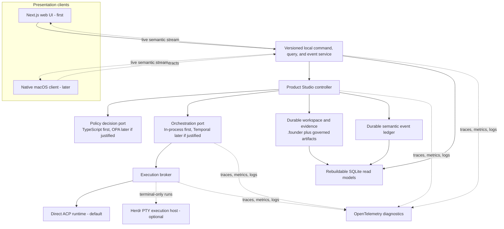

# Product Studio target architecture

## Status and intent

This document defines the post-MVP architecture direction as of 2026-08-09. It is a target and
sequencing contract, not a claim that every component described here is implemented. The current
Next.js application, file-backed controller, connected ACP runtime, and rebuildable SQLite index
remain the working baseline.

The near-term product is web-first. The long-term objective is a native macOS client backed by the
same local service, commands, semantic events, and durable evidence. Product Studio must not move
workflow authority into a browser component, a desktop client, an orchestration vendor, a policy
engine, a telemetry backend, or a terminal multiplexer.

## Architectural invariants

1. `.founder/` files and other versioned workspace artifacts are the durable workflow truth.
   SQLite, UI state, telemetry, and external runtime state are rebuildable projections.
2. The Product Studio controller alone validates expected phase, status, input revision, schema
   version, lease ownership, policy result, and completion evidence before changing state.
3. Every state-changing command is idempotent, bound to an explicit expected version or digest,
   and produces durable evidence before the mutation it authorizes.
4. Human-only gates remain human-only. An agent may request a decision or propose a command, but
   it cannot approve its own result or set a work item to `completed`.
5. Provider, model, protocol, process host, and orchestration identities stay behind adapters.
   They are provenance, never workflow phases or authority.
6. Reviewers remain source-read-only. Parallelism never weakens writer/reviewer independence,
   capability envelopes, deterministic verification, or evidence requirements.
7. MCP remains unsupported. None of the architecture below requires configuring, exposing, or
   proxying an MCP server.

## Planes and ownership

### Durable authority plane

The existing workspace repository and controller remain the system of record. Missions, run
records, evidence, results, decisions, approvals, and state transitions are published as durable,
hash-bound artifacts. The controller does not infer completion from process exit, a Temporal
status, an OPA response without its binding receipt, a Herdr agent state, or an OpenTelemetry span.

### Local application-service plane

Introduce one versioned, provider-neutral service contract with three surfaces:

- **Commands:** typed intents such as start, cancel, answer, request changes, acknowledge update,
  or approve an exact result. Commands carry an idempotency key and the expected governed tuple.
- **Queries:** rebuildable portfolio, work-item, run, attention, capability, and evidence views.
- **Events:** resumable, ordered semantic events with a stable event ID and cursor.

The current Next.js application may host these surfaces in-process first. Before a native client
is built, extract them behind a headless local service boundary so closing the web or desktop UI
does not stop owned execution. A loopback HTTP API plus Server-Sent Events is the first web
transport; a later macOS client may use the same loopback transport or a thin Unix-socket/XPC
bridge without changing schemas or controller behavior.

Clients never read or write `.founder/` directly. They issue commands and render queries/events.
That keeps browser and future native behavior identical and prevents a second state machine from
appearing in the client.

### Policy plane

Define a `PolicyDecisionPoint` port around the existing typed, pure TypeScript evaluators. Its
input contains the canonical operation, actor/principal, governed tuple, capability envelope,
resource facts, and policy version. Its structured result contains allow/deny, obligations,
reason codes, and a policy digest.

The embedded TypeScript implementation remains authoritative while Product Studio is a local,
single-process product. [Open Policy Agent](https://www.openpolicyagent.org/docs) becomes useful
only when the same policy must be evaluated consistently across multiple processes, the web and
native clients, remote workers, or multiple user roles. OPA makes policy decisions; the controller
and execution broker enforce them. A future OPA integration must:

- have one selected authority for each decision, never shadow TypeScript and OPA as competing
  enforcers;
- pin and hash the [policy bundle](https://www.openpolicyagent.org/docs/management-bundles) and
  version used for the decision;
- persist a Product Studio decision receipt before the authorized mutation;
- fail closed when a required decision is unavailable or undefined; and
- preserve the existing dedicated authorization shapes for shaping, Execute/Patch, and Review.

OPA is therefore an adoption option, not a current dependency.

### Orchestration plane

Keep the current controller-driven, in-process orchestration until real use demonstrates
long-lived waits, retry recovery, timers, fan-out/fan-in, or execution that must survive an
application restart. At that point, implement the orchestration port with
[Temporal Workflows](https://docs.temporal.io/workflows).

Temporal owns durable scheduling and resumption, not Product Studio truth or authority:

- A Temporal Workflow coordinates a bounded attempt graph.
- Activities perform external effects by invoking idempotent Product Studio application commands
  and execution-broker operations.
- Product Studio records the authoritative mission, evidence, result, and transition before an
  orchestration node is considered accepted.
- Workflow IDs derive from stable Product Studio attempt/run IDs. Temporal run IDs are retained as
  correlation provenance.
- Signals/updates may deliver input or cancellation intent, but the controller revalidates the
  exact governed tuple before applying it.
- Temporal visibility and event history are operational records, not a replacement for `.founder/`.

#### Graph-based and parallel workflows

Product Studio owns a versioned `ExecutionGraph` contract: typed nodes, dependencies, role,
capability profile, input/output artifact references, retry ceiling, timeout, and join rule.
Temporal is an execution backend for that graph, not the graph editor or graph source of truth.
The Temporal adapter schedules nodes whose dependencies are satisfied, runs independent nodes in
parallel, and joins their durable Product Studio results before unlocking a dependent node.

Use Activities for ordinary bounded nodes. Use
[Child Workflows](https://docs.temporal.io/child-workflows) only when a branch needs its own durable
lifecycle, worker boundary, or event-history partition. Start with one Workflow because Temporal
itself recommends that simpler shape until child workflows have a concrete need.

The safe first parallel use cases are read-only research, independent review perspectives,
verification, and evaluation. Parallel writers may not share a working tree. If concurrent write
branches are later justified, each receives an isolated Git worktree and capability envelope, and
an explicit merge/review node reconciles them. No fan-in node treats process success as accepted
work; every branch must satisfy its own result and evidence contract.

### Execution plane

An `ExecutionBroker` selects a connected runtime from declared capabilities, not vendor names.
Direct ACP remains the reference path because it already exposes structured operations and lets
Product Studio apply its capability and authorization evaluators.

[Herdr](https://herdr.dev/docs/concepts/) may later implement an optional `PtyExecutionHost` for
agents or tools that genuinely require a terminal, durable panes, human attach/detach, or remote
process supervision. Herdr stays behind the broker:

- Product Studio creates and maps a pane to one stable attempt/run identity.
- The UI never receives unrestricted access to Herdr's socket or input methods.
- User input is validated as a Product Studio command before the broker sends it to a pane.
- Herdr `working`, `blocked`, `done`, `idle`, and `unknown` states are hints for presentation and
  diagnostics only; they never complete or advance a Product Studio attempt.
- Pane output is sensitive and untrusted. Screen-history persistence stays off by default, raw
  output is bounded and redacted, and only typed semantic outcomes enter the event ledger.
- Detach/reattach is useful liveness, not durable workflow recovery. Herdr's
  [session-state contract](https://herdr.dev/docs/session-state/) says a server restart loses
  arbitrary processes, so Product Studio reconciliation and evidence remain necessary.
- Direct ACP remains available as the parity and recovery path. Herdr cannot become a mandatory
  dependency for the core workflow.

Product Studio remains a workflow control plane, not a terminal multiplexer. Herdr provides a
replaceable process host; it does not define the product's information architecture.

### Observability plane

[OpenTelemetry](https://opentelemetry.io/docs/concepts/observability-primer/) is the first external
backbone to adopt because it can expose latency, retries, failures, and cross-boundary causality
without changing workflow semantics. Instrument the local service, controller, policy port,
orchestration adapter, and execution broker with traces, metrics, and structured logs.

Propagate correlation fields such as work-item ID, attempt/run ID, mission/result digest,
orchestrator workflow/run ID, adapter ID, and optional Herdr workspace/pane ID. Use low-cardinality
attributes for metrics and keep high-cardinality identifiers on spans/logs where appropriate.

Telemetry is best-effort diagnostics:

- exporter or collector failure never blocks a workflow transition;
- sampling never changes durable evidence;
- prompts, credentials, raw terminal output, source content, customer data, and hidden model
  reasoning are excluded;
- user-facing Activity is never reconstructed from sampled telemetry; and
- retention/export is off or local by default until the founder explicitly configures it.

### Presentation plane: web first, macOS later

The web application proves the interaction and event contracts first. The default information
architecture remains Kanban-centric, with Updates as the cross-project temporal view and a Run
Console as the selected update/run detail.

The long-term native macOS client is another presentation adapter. It may add native notifications,
menu-bar status, windowing, keyboard shortcuts, and secure local credential integration, but it
must use the same command/query/event schemas and must not reimplement controller transitions,
policy rules, evidence validation, or orchestration logic in Swift. The native technology choice
remains open until the local service contract is proven by the web UI.

## Semantic events, telemetry, and terminal data

These three streams must remain separate:

| Data class | Purpose | Durable authority | Default UI |
| --- | --- | --- | --- |
| Semantic event | Explain a meaningful governed change or required action | Append-only Product Studio record with evidence references; never state authority itself | Updates, Activity, Run Console |
| OpenTelemetry signal | Diagnose latency, errors, retries, and cross-component behavior | No | Technical diagnostics only |
| Runtime/terminal frame | Operate or debug one live process | No; bounded ephemeral buffer unless explicit evidence extraction occurs | Hidden by default; optional technical terminal |

Each semantic event has a stable event ID, per-source sequence/cursor, type and schema version,
work-item and run identity, logical actor role, concise sanitized outcome, occurred and recorded
times, evidence handles, and optional action reference. Consumers resume from cursors and
deduplicate by event ID. Reconnection refreshes the authoritative query before applying newer
events so a missed stream cannot leave a silently stale client.

## Live Updates and Run Console

The web-first live experience uses an inbox-style split view:

- The left sequence lists meaningful updates across projects with seen/unseen state, truthful
  status, actor role, project, relative time, and whether a human action is required.
- Selecting a row opens the Run Console on the right without losing sequence position.
- The default Console is semantic: current bounded state, latest meaningful outcome, step graph,
  evidence, files, verification, findings, decisions, and the exact governed next action.
- A technical disclosure shows correlated diagnostics and, only for a PTY-backed run, an optional
  bounded terminal view.
- Closing the view never cancels execution. Reopening it reconstructs the state from durable
  queries and resumes the event cursor.

`queued`, `working`, `waiting_for_input`, `blocked`, `failed`, `cancelled`, `ready`, and `terminal`
must reflect an owned source. Do not label a run `paused` unless its runtime adapter can prove an
actual suspend/resume operation; otherwise use `waiting_for_input`, `detached`, or `cancelled`.

### Interaction contract

Every interaction is typed and visible in the semantic history:

1. **Agent asks for input:** the founder answers a specific pending question bound to the same
   attempt. The exact submitted response becomes durable run input before delivery.
2. **Founder asks for explanation:** the message is an interaction on the current attempt and the
   response is recorded as provenance. It grants no new write scope or transition authority.
3. **Founder changes direction or scope:** the controller cancels or pauses where supported and
   creates a new revision/attempt with a new input digest. It never silently mutates the active
   mission.
4. **Founder approves or requests changes:** the Console opens the existing evidence-bound
   controller decision. It does not create a second approval or reply route.

The UI optimistically marks only command submission, then renders the controller's accepted or
rejected result. No action remains silent: accepted commands produce a semantic event; rejected
commands show the reason without pretending the underlying state changed.

## Agent-native contract

Product Studio exposes controller primitives rather than scripting one giant “run my feature”
tool. The same versioned commands available to the web and future macOS clients can be exposed to
approved automation adapters, subject to the same capability envelope and principal. Operational
parity does not erase authority: an agent can request a human-only gate but receives a typed denial
if it attempts to authorize one.

- **Parity:** UI actions map one-to-one to documented controller commands; clients contain no
  hidden mutation path.
- **Granularity:** read, start, answer, cancel, acknowledge, request-changes, and exact-result
  approval remain narrow operations with typed inputs and outputs.
- **Composability:** stable IDs, schemas, cursors, and evidence handles let clients and agents chain
  primitives without parsing UI copy or terminal text.
- **Emergent capability:** bounded primitives can compose future graph workflows and new clients
  without adding provider-shaped phases.
- **Capability discovery:** a query reports runtime features such as structured events, input,
  cancel, real pause/resume, PTY attach, and parallel-safe worktrees. Unsupported actions are
  absent or return a typed unsupported result.
- **Context:** mission compilation injects only the current governed contract, selected artifacts,
  applicable profile/skill versions, capability envelope, and completion contract. Context is
  refreshed at node boundaries rather than copied as an unbounded conversation.
- **Partial completion:** every node reports accepted output, failed output, or explicit remaining
  work. Context or runtime exhaustion produces a resumable attempt state with evidence; it cannot
  masquerade as success.

## Failure and recovery rules

- A client reconnect starts with an authoritative snapshot and cursor, then resumes events.
- An orchestration retry reuses idempotency keys and cannot publish a second accepted result.
- A policy-engine outage fails closed only for decisions that require it; read-only inspection
  remains available.
- An execution-host disconnect makes liveness unknown until reconciled; it does not infer failure
  or success.
- OpenTelemetry failure is ignored by product logic and surfaced only as lost diagnostics.
- A local service restart reconciles controller leases, durable run records, external workflow
  handles, and process-host handles before accepting a conflicting launch.
- Cancellation is a durable intent plus adapter action. The UI distinguishes requested,
  acknowledged, and terminal cancellation.

## Adoption sequence and proof gates

1. **Finish ROADMAP 3.4:** prove one real end-to-end feature through the current controller and
   direct ACP adapter. Do not hide current contract gaps behind new infrastructure.
2. **ROADMAP 4.1 — web live experience:** implement the semantic-event ledger, resumable live
   transport, Updates split view, semantic Run Console, interaction commands, and local
   OpenTelemetry instrumentation.
3. **Local service extraction:** move controller ownership and connected execution into a headless
   local service while the Next.js web UI remains the only product client. Prove reconnect,
   restart, and UI-close behavior.
4. **Temporal adoption gate:** add Temporal only when a tested scenario needs restart-surviving
   waits/retries or a parallel execution graph. Prove replay safety, idempotent activities,
   cancellation, fan-in, and reconciliation against `.founder/` truth.
5. **OPA adoption gate:** add OPA only when policy must be shared across runtime or principal
   boundaries. Prove bundle pinning, decision receipts, fail-closed behavior, and exact parity with
   the selected TypeScript policy corpus before switching authority.
6. **Herdr adoption gate:** add the optional PTY host only for a real adapter that cannot deliver
   the required interactive capability through structured ACP. Pin a reviewed version and prove
   crash, detach, stale-state, input-race, secret-redaction, and direct-ACP recovery behavior.
7. **Native macOS client:** build only after command/query/event schemas and the headless runner
   survive web dogfooding. The native client must pass the same contract suite as the web client.

No step above authorizes adding the dependency before its proof gate is selected as active roadmap
work.

## Open architecture decisions

- Whether the headless local service is a Next.js-owned companion process or a separate packaged
  TypeScript daemon.
- Whether the native client uses direct loopback HTTP/SSE, a Unix-socket bridge, or XPC while
  preserving the same payload schemas.
- Whether the macOS UI should be fully SwiftUI or a native shell around the proven web surface.
- Which first real workflow requires an `ExecutionGraph` rather than the current linear bounded
  cycle.
- Whether a real terminal-only adapter justifies Herdr after direct ACP parity and security tests.
- When shared policy complexity is high enough to justify OPA rather than the embedded evaluator.
- Whether OpenTelemetry remains local-only or gains an explicitly configured collector/exporter.
