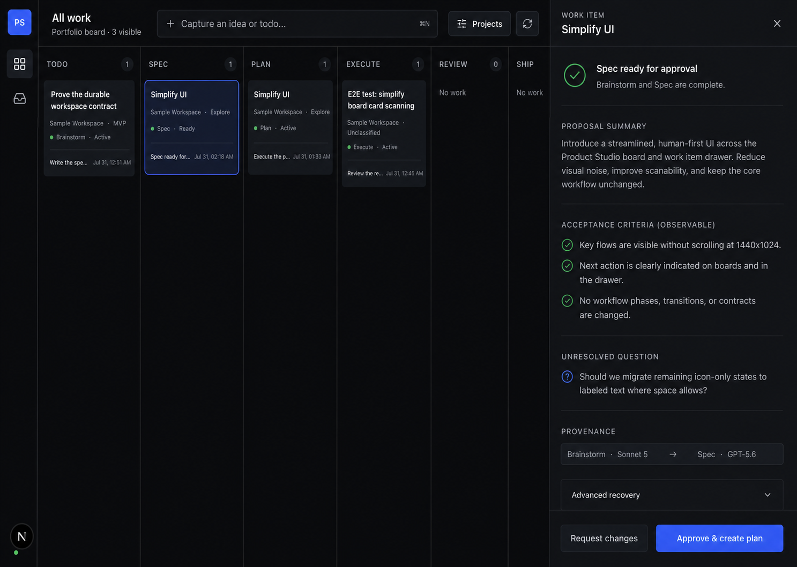

# Product Studio Design System

## Overview

Product Studio is a focused control plane for a technical solo founder managing ideas, todos, product work, and interchangeable AI agents across several projects. It should feel like a serious desktop work surface: calm, compact, trustworthy, and immediately actionable.

The primary experience is always the Kanban. There is no dashboard home screen. Navigation and editing live in collapsible side panels so the founder can maximize the board when scanning work, then bring context into view without leaving it.

The visual personality is **restrained operational minimalism**:

- Dark, matte surfaces rather than decorative gradients or glass.
- Thin dividers and tonal layering rather than shadows.
- Compact information density without visual noise.
- One clear action at a time.
- Status that is understandable without watching agents work continuously.
- Technical detail available on demand, never dominating the default view.

The interface must help the founder step away for hours, return, understand what changed, and review or approve work without reconstructing model sessions.

### Canonical screen states

The application has three canonical desktop states. They share the same shell and board position.

1. **Focused Kanban:** The left navigation is collapsed to an icon rail and the right panel is closed. The board receives maximum width.
2. **New idea or todo:** The left rail remains collapsed and a 390px right panel opens with a progressive capture form.
3. **Work-item detail:** The left rail remains collapsed and a 410px right panel opens for reading, editing, replying, reviewing evidence, or approving a card.

Side panels change state; they do not navigate to separate page designs. Opening or closing a panel must preserve board filters, horizontal position, vertical position, and selected card.

### Product principles expressed visually

- **Progress over administration:** Capture, clarify, start, review, approve, pause, and complete are visually dominant. Settings are quiet.
- **Portfolio first:** The same Kanban can show all projects or a filtered subset.
- **Minimal commitment at capture:** A sentence is enough. Project, priority, and context are optional.
- **Progressive structure:** More fields and evidence appear as work advances.
- **One next action:** Every active card shows a single concise next step.
- **Quiet by default:** Git metadata, raw transcripts, provider configuration, and logs remain behind explicit disclosure.

## Colors

The palette uses high-contrast cool neutrals with one restrained blue interaction color.

- **Primary (`#2F61F5`):** Selection outlines, primary buttons, active tabs, links, and keyboard focus. Do not use it as decoration.
- **Background (`#090A0C`):** The deepest application canvas and collapsed navigation rail.
- **Surface (`#101216`):** Side panels, inputs, column fields, and grouped content.
- **Raised surface (`#15181D`):** Kanban cards and compact contained controls.
- **Hover surface (`#1B1F26`):** Hovered cards, rows, and secondary controls.
- **Selected surface (`#111C34`):** Very subtle blue-black fill behind a selected card.
- **Borders (`#252932`, `#3A404D`):** Structural separation and stronger focus/hover boundaries.
- **Primary text (`#F2F4F7`):** Titles, card names, form values, and decisions.
- **Secondary text (`#A6ACB7`):** Descriptions, supporting labels, and helper copy.
- **Muted text (`#7F8794`):** Metadata, timestamps, keyboard hints, and inactive labels.
- **Success (`#34C759`):** Agent online/active dots and passed checks.
- **Warning (`#E4B93F`):** Non-blocking findings and attention that needs judgment.
- **Danger (`#FF5A5F`):** Errors, blocked work, destructive actions, and the dot in `Needs you` when urgency warrants it.

Color is semantic. Do not assign a permanent color to every project, model, tag, or card type. If project dots are used in the expanded project list, keep them tiny and never let them compete with workflow status.

Maintain WCAG AA contrast for all normal text. Muted text may never be used for essential instructions, unresolved findings, or button labels.

## Typography

Use **Inter** when bundled. Fall back to **SF Pro Text** on Apple platforms and then the operating-system sans-serif. Do not introduce a display font, monospaced font, or a second family in the primary UI.

The scale is intentionally compact:

- `heading-lg` (22px/600): Rare screen-level headings only.
- `heading-md` (16px/600): Panel titles and important section headings.
- `heading-sm` (14px/600): Card titles and grouped form headings.
- `body-md` (14px/400): Inputs, descriptions, comments, and evidence.
- `body-sm` (13px/400): Supporting copy and compact rows.
- `label-md` (13px/500): Buttons, tabs, filters, and form labels.
- `label-sm` (12px/500): Chips, small controls, and counters.
- `label-caps` (12px/600): Kanban column labels only; use uppercase and modest tracking.
- `metadata` (12px/400): Actor, duration, file count, timestamps, and keyboard shortcuts.

Use no more than regular, medium, and semibold weights. Bold text is unnecessary. Never use large marketing-style display headings inside the product.

Keep card titles to two lines. Truncate supporting card content before compressing typography below its token size. Long-form panel text should stay near 55–65 characters per line.

## Layout

### Desktop application shell

The canonical design target is a 1440 × 1024 desktop viewport. The shell fills the viewport; it is not centered inside an application card.

- **Collapsed left rail:** 58px fixed width.
- **Expanded left navigation:** 220px fixed width.
- **Top bar:** 64px fixed height above the work surface.
- **Return-summary strip:** 48px tall when present.
- **Create panel:** 390px wide.
- **Detail/review panel:** 410px wide.
- **Board:** Uses all remaining width and height.

The left rail, board, and right panel are siblings in one layout. A right panel should reduce the board viewport rather than float over cards. The board retains its own horizontal scrolling when available width cannot show every column.

### Left navigation

The collapsed rail is the normal focus state. Use a vertical sequence of 20px line icons within 40px targets. Separate global navigation, projects, and utilities with quiet 1px dividers or spacing.

The expanded state may show:

- All work.
- Inbox with unassigned-capture count.
- Updates with unseen meaningful-update count when the post-v1 view is implemented.
- Needs you with unresolved-decision count.
- Live products when implemented.
- Project list.
- Settings and trash at the bottom.

The rail must always expose a visible collapse/expand control. Expanded content must not force a change in the board's filters or selection.

`Inbox`, `Updates`, and `Needs you` are distinct concepts. Inbox is the unassigned capture source.
Updates is an email-like, cross-project sequence of meaningful workflow changes. Needs you is the
actionable subset containing unresolved human decisions. Do not reuse `Inbox` as the label for an
updates or attention route.

### Top bar

The top bar contains, in order:

1. Current scope title, normally `All work` or the selected project.
2. Command-style capture field: `Capture an idea or todo…` with `⌘N` hint.
3. Search.
4. Project filter.
5. `Needs you` count.
6. View/filter settings.

Do not add global metrics, agent-cost charts, greetings, or decorative product messaging to this area.

### Since-you-were-away summary (post-v1)

When meaningful changes occurred after the user's last acknowledged visit, show one compact strip immediately below the top bar:

> Since you were away · 7 updates across 3 projects

The strip has one primary text action, `Review updates`, plus a dismiss control. It is an entry point into Updates, not a dashboard or generic activity feed.

Rules:

- Hide the strip when there are no meaningful updates.
- Count completed agent attempts, new review findings, newly blocked work, and human decisions requested.
- Do not count background indexing, autosaves, or duplicate status events.
- `Review updates` opens the relevant Updates sequence and advances through cards in chronological or priority order using the existing right panel.
- Dismissal records the last acknowledged event, not merely the current time.
- A critical blocked item may add a warning dot, but the strip stays visually calm.

### Semantic activity and update review (post-v1)

All update surfaces use the same stable semantic-event identity and evidence handles:

- **Board:** The primary spatial workflow view. It shows current state and one next action, not a
  chronology.
- **Activity:** The complete meaningful history for one governed work item, including resolved and
  superseded entries.
- **Updates:** An email-like cross-project review sequence with seen and unseen state.
- **Needs you:** Unresolved human decisions only; it is the actionable subset of the same semantic
  history.
- **Since you were away:** A temporary entry point into the current Updates sequence.

Viewing, acknowledging, and resolving are separate actions. Opening an update may reveal it, but
only the defined acknowledgment action advances the last-acknowledged event position; resolving a
decision removes it from Needs you without deleting it from Activity. Empty, loading, failed,
filtered-out, superseded, already-resolved, and caught-up states must be explicit.

Updates should support efficient sequential review and preserve project scope while moving to the
next entry. An actionable row opens the existing detail panel at the exact evidence-bound approval
or reply control, then continues the sequence without creating a second mutation path.

Persist concise typed outcomes and immutable evidence references, not raw reasoning, token streams,
unbounded terminal output, autosaves, indexing activity, or duplicate controller events. Show the
logical actor role on the semantic entry. Model, harness, effort, and adapter details remain behind
progressive disclosure, carry their observed/attested/declared/unknown assurance, and never imply
authorization.

### Kanban board

The board is the dominant surface and uses these columns:

1. Todo (`idea`, `brainstorm`).
2. Spec.
3. Plan.
4. Execute.
5. Review (`review`, `test`).
6. Ship.
7. Done (`learn`).

Columns have a minimum useful width of 224px and expand modestly when space allows. Keep 8px between columns or separate them with a single vertical divider. The column header remains visible while its cards scroll vertically.

The board should support horizontal scrolling without moving the top bar or side panels. Use a thin, low-contrast scrollbar. Preserve scroll position when panels open and close.

`Blocked`, `paused`, `failed`, and `needs attention` are card states or filters, not permanent columns. Do not turn the board into a ten-stage process diagram.

### Responsive behavior

- **≥1280px:** Use the canonical desktop shell.
- **1024–1279px:** Keep the left rail collapsed. Right panels may grow to no more than 40% of the viewport. Board scrolls horizontally.
- **768–1023px:** Right panel may overlay the board with a scrim because preserving a usable panel is more important than simultaneous column visibility.
- **<768px:** Treat the product as a review/capture companion. Show one column or filtered list at a time; panels become full-screen sheets. Full portfolio planning remains desktop-first.

## Elevation & Depth

The interface is flat. Hierarchy comes from tonal layers, dividers, selection outlines, spacing, and typography—not shadows.

- Application canvas: `background`.
- Board columns and side panels: `surface` or the canvas with divider boundaries.
- Cards and contained controls: `surface-raised`.
- Hovered elements: `surface-hover`.
- Selected cards: `surface-selected` plus a 1px primary outline.
- Focused inputs and keyboard targets: 2px primary focus ring with adequate offset.

Avoid drop shadows in the normal shell. A subtle shadow is allowed only for a temporary mobile sheet, menu, tooltip, or drag preview that must separate from content underneath.

Do not use glassmorphism, blur, glow, gradients, bevels, inner shadows, or floating dashboard cards.

## Shapes

The shape language is engineered with modest softness:

- Square corners for the application shell, side panels, board columns, and full-height structural regions.
- 4px radius for tiny tags and counters.
- 6px radius for cards, buttons, inputs, dropdowns, summary strips, and grouped evidence.
- 8px radius only for temporary popovers or larger contained utilities.
- Full radius only for status dots and small numeric count badges.

Do not mix highly rounded consumer-SaaS cards with sharp operational surfaces. Avoid large pill buttons except compact status/count indicators where the shape communicates containment.

Icons use a consistent 1.5–2px outline style at 16px or 20px. Do not use emoji, filled clip-art icons, branded model logos, or decorative illustrations in the application shell.

## Components

### Kanban card

A card is a concise status object, not a miniature detail page. It contains:

1. Title, up to two lines.
2. Project name or `Unassigned`.
3. Work type.
4. Current durable phase and status.
5. One next-action label or compact button.
6. A status dot only when it communicates active, attention, blocked, or review state.

Cards use 12px padding and an 8px vertical internal rhythm. Default card fill is `surface-raised`. Hover uses `surface-hover`. Selection uses a 1px primary outline and an extremely subtle `surface-selected` fill.

Do not show full descriptions, multiple paragraphs, raw model output, branch names, repository paths, token counts, or more than two tags on a card.

### Column header

Use `label-caps`, left aligned, with a small count badge aligned right. The header should not visually resemble a card. `Add item` is a quiet text action at the end of the card list.

### New idea or todo panel

The create panel slides in from the right at 390px. It uses this progressive order:

1. Header `New idea or todo`, with close control.
2. Segmented type control: `Idea` / `Todo`.
3. Main field `What are you thinking?`.
4. Optional project, default `Unassigned`.
5. Optional priority, default `Normal`.
6. Optional link or file.
7. Optional context.
8. `Start brainstorm` — an explicit action on an assigned, active `idea` that performs the
   `idea → brainstorm` transition on save and immediately surfaces the shaping handoff (see
   "Work-item detail panel" below).
9. Sticky footer actions: `Save to Inbox` and `Save & explore`.

Only the main thought is required. Never ask for model, harness, repository, branch, effort, workflow, budget, or acceptance criteria during initial capture.

The main thought field should be immediately focused when opened from `⌘N`. `Escape` closes the panel after confirming only when unsaved content exists.

### Work-item detail panel

The detail panel slides in from the right at 410px. Its header includes editable title, project, type, status, overflow menu, and close control. Use tabs only when content warrants them:

- Overview.
- Activity.
- Files.

Overview prioritizes:

1. Goal or original thought.
2. Acceptance progress.
3. Latest agent update.
4. Deterministic verification evidence.
5. Reviewer findings.
6. Reply or request-changes composer.
7. Sticky contextual actions.

This ordering describes Execute/Review-phase items. For a `brainstorm`, `spec`, or `plan` item,
the panel leads with the guided shaping projection — bounded connected-run status or the current
result's decision surface — in place of items 3–5. Manual compile, external `TASK.md` execution,
and result import stay in collapsed `Advanced recovery`; a captured item's narrow panel (below)
hosts the same projection whenever one of those three shaping phases is active.

For review-ready work, the footer uses primary `Approve result` and secondary `Send comments`.
Approval binds to the exact result being displayed — including a shaping acceptance receipt, which
pins the result SHA the same way. If the result changes, invalidate the prior approval and make
that visible.

`Edit details` exposes project, priority, type, goal, or scope without replacing the entire panel. Editing must preserve the original capture and activity history.

Activity uses the shared semantic history rather than reconstructing a separate feed. Entries lead
with a human-readable outcome and timestamp, retain resolved decisions and superseded results, and
link to exact evidence when available. Raw tool and provider detail remains collapsed.

For a captured idea/todo, keep refinement in a narrow structural side panel: show the immutable original thought, kind, and captured-at timestamp read-only above the editable metadata (project, type, tags, notes). This panel may additionally carry the guided shaping handoff for an item in any of the three eligible phases: `brainstorm`, `spec`, or `plan`. Give a ready Brainstorm result a first-class selection action: selecting that result is an input selection, not result approval, while a ready Spec result has its own explicit approval action. Keep compile, external `TASK.md` execution, and result import in the collapsed recovery path. Do not let this panel accrete an activity feed or reviewer findings — those stay part of the full work-item detail panel once a capture has been promoted into a governed work item.

#### Connected guided handoff through Review and Patch (ROADMAP 3.4 Slices 2–3)

This mockup is directional and non-normative. The written lifecycle, state, authorization, and
artifact contracts remain authoritative; never infer duplicate or missing card states from the
image.

The normal shaping path should feel like one guided continuation rather than a sequence of artifact
operations:

1. Every founder action asks the controller to advance the item; it does not mutate lifecycle state
   directly in the browser. The controller commits the action first, releases its lease, and only
   then idempotently launches the connected Brainstorm, Spec, Plan, or Execute mission. If that
   launch fails after the commit, the decision stands and the surface shows the truthful new phase
   with the appropriate `Start` or `Retry` recovery action.
2. While an agent works, show only truthful bounded states — queued, working, blocked, failed, or
   ready — with a concise latest update. Do not invent percentages or expose raw logs and token
   streams.
3. A mission revision carries one applied result. When that result is ready, replace the operational
   handoff controls with a decision surface for that result rather than a candidate comparison. Lead
   with the phase's concise summary, governed decision fields, unresolved questions where supplied,
   and compact provenance. Keep the full metadata editor, duplicated goal-contract fields,
   model/runtime details, evidence, and recovery controls outside the default decision surface.
4. Keep the decision footer persistent and name the six founder actions directly: `Start
   Brainstorm`, `Use result & run Spec`, `Approve & run Plan`, `Approve & run Execute`, `Request
   changes & rerun`, and `Replan with updated contract`. `Start Brainstorm` is the only route from
   Idea into Brainstorm; its connected action includes the Brainstorm model and advances and
   launches in one action, while `Start Brainstorm without a model` is its manual recovery variant.
   `Approve & prepare Execute` is the Plan approval's manual recovery variant. `Request changes &
   rerun` requires feedback and uses a current-seat model. Put the next-seat model picker on the
   current decision surface and show every prior seat's requested and effective model, rendering an
   unobserved model as the literal `unknown`. Recommend and preselect an unused model ahead of a
   saved preference that was already used; warn about reuse without blocking it. The guided handoff
   reaches Execute only when the founder approves the exact Plan result against the current governed
   contract; that approval creates the governed Execute handoff. The generic `idea → spec`, `spec →
   brainstorm`, and `plan → spec` arrows are closed in favour of `Request changes`.
5. If the Spec result changes or is replaced, invalidate the prior approval and return the item to
   an explicit decision state. An agent cannot approve its own result or advance through a human
   gate.
6. Keep compile, external `TASK.md` execution, the manual ingress path and recovery task, result
   import, and similar artifact controls under a collapsed `Advanced recovery` disclosure. They
   remain fully supported and truthful, but they are not the normal founder journey once connected
   launch is available. This collapsed-recovery rule already covers the Review and Patch manual
   controls below and needs no separate carve-out.
7. The guided handoff continues past Execute approval into connected Review and its bounded Patch
   continuation (ROADMAP 3.4 Slice 3). Review carries **no permission-decision surface at all** —
   deliberately, not by omission — because its authorization shape is source-read-only,
   single-result-ingress rather than the Execute capability envelope. Its decision surface instead
   shows an explicit `Read only` status and, before launch, requires the founder's writer/reviewer
   **model independence attestation** (the human affirms the reviewing model differs from the one
   that wrote the code under review; the workflow does not enforce this automatically). Bounded
   drift between the reviewed subject and the tree at ingress is disclosed on the result rather than
   silently accepted or blocked. Patch reuses the existing Execute-style decision surface and model
   picker, scoped to the findings Review routed to it.

At a 1440×1024 viewport, the proposal summary, acceptance criteria, unresolved questions, compact
provenance, and both decision actions should be understandable and reachable without scrolling.
Long evidence and recovery detail may continue below a disclosure.

### Agent update

Summarize an agent attempt in one contained block:

- Human-readable outcome.
- Agent name and status dot.
- Duration.
- Files changed.
- Verification state.
- `View changes` action.

Do not show a live token stream by default. Use `Working · 8 min` or an indeterminate state instead of fabricated percentage progress unless the underlying workflow provides a defensible measurement.

A connected (locally launched) agent run follows the same rule: project only the latest sanitized
run summary and its provenance (runtime/model/effort, bounded status, one recovery action set) —
never raw terminal output, protocol/token streams, or diagnostic internals. Launch controls use a
synchronous in-flight guard for rapid-click feedback, but the durable per-item launch guard
remains the sole authority that prevents a duplicate run.

An imported shaping result (a compiled mission's proposal, brought in via `Use proposal as draft`)
is neither live nor connected — it is a proposal, not current card state. Label it visibly as a
proposal and never render it as an agent-update block; adopting it into a draft field fires no
network request.

### Reviewer finding

A finding contains severity, concise title, evidence summary, and affected acceptance criterion when available. Use:

- Warning for minor or non-blocking findings.
- Danger for blocking or high-risk findings.
- Neutral styling for informational notes.

The reviewer does not directly edit the work. Findings feed the reply/patch loop.

### Buttons

- Primary buttons use `primary` with white text and are reserved for the most important action in the current panel or gate. In a governed panel with `Save` already primary, shaping actions (compile, import, accept) use secondary or tertiary styling — never a second primary.
- Secondary buttons use raised dark surfaces and a quiet border.
- Tertiary actions are text or icon buttons with no filled container until hover.
- Destructive actions use danger only after intent is clear and usually require confirmation.
- Standard control height is 36px; top-bar search/capture fields may use 40px.

Do not place two visually primary buttons side by side. When two actions are needed, establish a clear primary/secondary hierarchy.

### Inputs and forms

Labels sit above fields. Placeholder text is muted but must remain readable. Helper text appears only when it prevents confusion.

Inputs use `surface`, 1px `border`, 6px radius, and 12px horizontal padding. Focus uses primary, never a glow. Errors use danger for the boundary and a concise explanation below the field.

Use progressive disclosure. Avoid large forms that require users to structure an idea before saving it.

### Filters and search

The project filter supports all projects, one project, or a multi-project selection. Active filter count may appear in the filter control. Filters should never alter underlying work-item state.

Search covers card titles and meaningful artifact content. Results remain in the board when possible so the user retains spatial context.

### Counts and status indicators

Numeric badges are compact and neutral. Status dots are 6–8px and always paired with text or accessible labels. Never rely on color alone.

### Keyboard behavior

- `⌘N`: Open new idea/todo panel.
- `⌘K`: Open search/command palette when implemented.
- `Escape`: Close the topmost panel or popover, subject to unsaved-change protection.
- Arrow keys: Navigate cards within a column.
- `Enter`: Open selected card.
- `Shift` plus arrow keys or an explicit move command: Move a card only when the workflow transition is valid.

All interactive targets must be at least 36 × 36px on desktop and 44 × 44px on touch layouts, even when the visible icon is smaller.

## Do's and Don'ts

### Do

- Do keep the Kanban as the default and largest surface.
- Do let both side panels collapse so the board can occupy nearly the full viewport.
- Do open capture, card editing, replies, review, and approval in the reusable right panel.
- Do preserve board context and filters while panels open and close.
- Do use the `Since you were away` strip only when meaningful changes exist.
- Do show exactly one next action on an active card.
- Do distinguish user-authored content, AI proposals, accepted fields, and unresolved questions.
- Do make deterministic checks and reviewer evidence visible before approval.
- Do use files and durable workflow state as the source of truth; the UI is a projection and command surface.
- Do meet WCAG AA contrast and provide non-color status cues.
- Do make keyboard capture and navigation first-class.

### Don't

- Don't create a dashboard home screen.
- Don't add charts, metric tiles, vanity counts, greetings, or activity feeds merely to fill space.
- Don't expose GitHub, repository paths, branches, worktrees, raw transcripts, or model configuration on the primary board.
- Don't force project assignment or detailed structure during capture.
- Don't turn every section, row, or field into a floating card.
- Don't nest cards inside cards.
- Don't use large radii, glassmorphism, gradients, decorative glows, illustrations, or heavy shadows.
- Don't color-code every project, model, type, and status simultaneously.
- Don't show simulated percentage progress for LLM work unless it is based on measurable workflow steps.
- Don't let an agent mark work completed or approved.
- Don't silently accept an invalid drag-and-drop transition; explain the required gate or next action.
- Don't hide blocking findings in muted text.
- Don't replace the board when opening details; use the right panel and preserve spatial context.
- Don't add a second approval surface for connected-run permission recovery; keep it one
  read-only summary (normalized capability, reason, exact decision actions) in the existing
  Inbox/detail-panel surfaces, and keep the board card path for it intentionally hidden.
