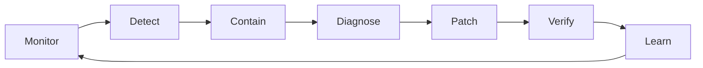
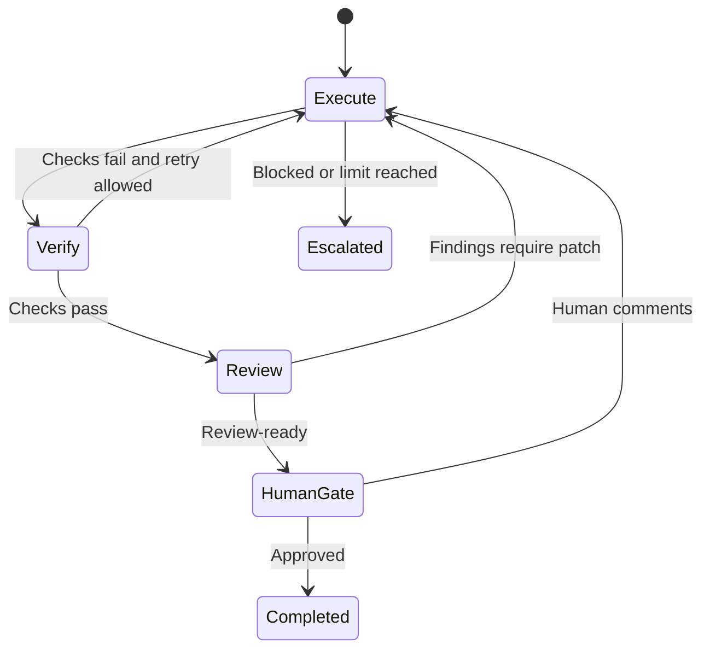
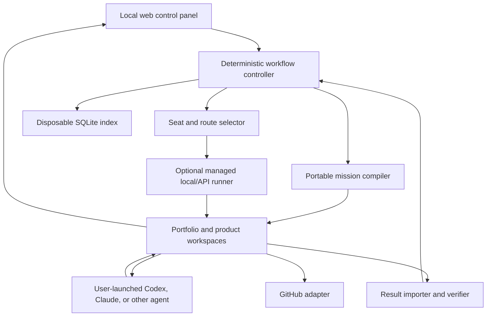

# AI Product Studio — Product Requirements Document

| Field | Value |
| --- | --- |
| Working title | AI Product Studio |
| Product category | Solo-founder product control plane |
| Document status | Draft for implementation |
| Version | 0.2 |
| Last updated | 2026-07-17 |
| Initial customer | The product owner as a technical solo founder |
| Initial delivery model | Local-first, single-user application |

> **Working product promise:** Turn a backlog of product ideas into live, maintained experiments without manually coordinating AI agents, repositories, reviews, and deployment pipelines.

### Revision history

| Version | Date | Summary |
| --- | --- | --- |
| 0.1 | 2026-07-17 | Initial product, workflow, state, routing, evaluation, and operations definition |
| 0.2 | 2026-07-17 | Made the focused UI and Kanban the MVP center; added portable mission packages and bring-your-own-agent execution before managed CLI automation |

## 1. Executive summary

AI Product Studio is a control panel for a technical solo founder who wants to explore, build, launch, and operate multiple software products with the help of interchangeable LLM agents.

The product addresses a growing coordination problem. Modern models can brainstorm, research, specify, implement, review, test, and troubleshoot software, but the founder still has to coordinate multiple CLI sessions, repeatedly restore context, move artifacts between tools, track progress, compare models, control costs, and decide when work is genuinely ready. As the number of ideas, products, agents, and model providers grows, the founder's attention—not code generation—becomes the bottleneck.

AI Product Studio makes the product portfolio, rather than the terminal or repository, the primary workspace. A clean, focused Kanban provides the everyday experience: ideas and todos can be captured in seconds, explored with AI, filtered by project, and progressed without navigating implementation systems. The user defines an outcome and delegates work to a bounded goal-seeking loop. Executors implement, deterministic checks verify, independent reviewers critique, and the system iterates until the work is review-ready, blocked, or reaches a predefined limit. The founder is brought in only at meaningful decision gates. In the MVP, the platform prepares and validates each handoff while the founder launches external agents; managed loops can automate those launches later.

The architecture treats agent sessions as disposable and product state as durable. Specifications, plans, decisions, memory, evaluations, run manifests, and workflow state are persisted in files and version control. No model session owns essential context. A different model or harness can take over at any point by reading the same workspace.

The platform does not need to execute every model itself. For the MVP, it creates a portable mission package that can be handed to Codex, Claude Code, another CLI, an API agent, or a future model. The user may open the preferred agent manually, point it to the mission, and let it work directly in the repository. The platform then detects or imports the result, validates it, advances the workflow, and prepares the next executor, reviewer, or human decision. One-click launch and managed execution are progressive enhancements rather than prerequisites for proving the core value.

GitHub is the initial repository, pull-request, CI/CD, and deployment adapter. It is infrastructure underneath the product, not the product's user experience or permanent source of product-specific assumptions.

The initial application is built for one user and dogfooded while creating real revenue-oriented products. Commercial productization is considered only after the application has successfully managed multiple real products and measurably reduced the founder's workload.

## 2. Product thesis

### 2.1 Core beliefs

1. **The capability-to-cost frontier of models will continue to improve.** Individual models may regress, change, or disappear, so the platform must make replacement routine rather than exceptional.
2. **Models are rented; workflows and learnings are owned.** The durable asset is the accumulated product memory, workflow contracts, evaluation cases, promoted principles, and execution evidence.
3. **The human bottleneck is attention.** The product must reduce coordination, repeated explanation, supervision, and unnecessary approvals—not merely generate more code.
4. **A goal is more useful than a chat.** The primary execution primitive is a bounded, testable work loop with explicit acceptance criteria.
5. **No hidden memory.** Correctness must not depend on a particular conversation, session-resume feature, model provider, or local database.
6. **Autonomy is earned.** Human gates can move from full review to sampling or notification as evidence accumulates, subject to permanent risk floors.
7. **Deterministic checks come before model judgment.** Tests, builds, linting, schemas, policy checks, and other objective validation should run before paying an LLM reviewer.
8. **Independent review is defense in depth.** The model or vendor that writes logic-bearing work should not be the only reviewer of that work.
9. **The control panel is provider-neutral.** GitHub, model vendors, CLI tools, deployment providers, and local runtimes are adapters behind stable product concepts.
10. **The platform must justify its own existence.** It succeeds only if it reduces human time, cost, or risk while helping ship products that create real customer value.
11. **The UI is the product's daily value surface.** Capturing, understanding, filtering, and progressing work must feel faster and calmer than juggling repositories, terminals, and issue trackers.
12. **Execution is replaceable.** The platform owns intent, workflow state, evidence, and next action; any capable external agent may perform an individual execution attempt.

### 2.2 Product positioning

AI Product Studio is not primarily:

- An IDE.
- A terminal multiplexer.
- A generic project-management tool.
- A chat interface for multiple models.
- A visual wrapper around a single coding agent.

It is:

> **A portfolio-level operating system for delegating product outcomes to interchangeable AI workers while retaining human control, durable memory, and evidence of quality.**

### 2.3 Primary value proposition

The product should let the founder say:

> “Take this defined outcome, work on it within these limits, independently review the result, and return when it is ready for my decision or genuinely blocked.”

The founder may invoke that work from the control panel or hand the generated mission to a preferred external agent. The workflow and durable state remain the same.

## 3. Problem statement

### 3.1 Current situation

Technical solo founders increasingly use several AI coding tools and models. Work is distributed across terminal sessions, repositories, model conversations, Markdown files, issue trackers, deployment dashboards, and personal notes.

Typical problems include:

- No clear portfolio-level overview of ideas, prototypes, active work, live products, incidents, and items awaiting attention.
- Repeatedly explaining the product, architecture, decisions, and current work to new model sessions.
- Manually copying artifacts and review comments between models and CLIs.
- Difficulty handing work from one model to another without losing context.
- Model-specific memory becoming stale, hidden, or inaccessible.
- No consistent mechanism for an executor/reviewer iteration loop.
- Unbounded retries that waste tokens, time, or subscription quota.
- Inconsistent review quality and no evidence-based method for selecting models.
- Difficulty comparing API cost, subscription capacity, local compute, quality, and latency.
- Model releases and pricing changes requiring manual reconfiguration.
- Important decisions, prompts, model versions, and approvals not being reproducible.
- Building and shipping receiving more attention than monitoring, maintenance, learning, and product retirement.
- Git and project-management interfaces exposing implementation details rather than what the founder needs to decide.
- Capturing a quick thought or todo requiring the user to choose a repository, phase, model, or execution method before the idea is understood.
- Existing agent applications being effective inside one project but not providing a calm, cross-project view of what should progress next.

### 3.2 Root problem

Models can perform increasingly large portions of product work, but there is no lightweight, durable control plane that converts product intent into bounded agent work while preserving context, quality evidence, learning, and human authority across a portfolio.

### 3.3 Desired outcome

The founder should be able to manage multiple product ideas and live products from one interface, delegate well-defined work without supervising each prompt, and switch models or execution methods without rebuilding the workflow or losing product knowledge.

## 4. Target users

### 4.1 Primary user: technical solo founder

A developer or technically capable product builder who:

- Has more viable ideas and product work than available time.
- Is actively attempting to ship products, not merely collect ideas.
- Uses multiple AI coding assistants, CLIs, APIs, or local models.
- Works across multiple repositories or prototypes.
- Wants to remain a one-person business or very small operation.
- Values control and inspectability but does not want to manually orchestrate every agent action.
- Is willing to define goals, review consequential decisions, and maintain product direction.

The initial user is the product owner, ensuring direct access to the real problem and allowing rapid dogfooding.

### 4.2 Possible later users

- Two- or three-person product studios.
- Independent consultants managing several client products.
- Technical founders operating portfolios of micro-SaaS products.
- Small development agencies that want governed agent workflows without building internal orchestration.

These users are explicitly outside the first release unless their needs naturally align with the single-user architecture.

### 4.3 Anti-persona

The initial product is not designed for:

- Non-technical users expecting an entirely no-code website builder.
- Large engineering organizations requiring enterprise planning, compliance, and team administration.
- People looking only for a better terminal or model chat interface.
- Users who want fully autonomous, unsupervised production changes with no accountability.
- Idea collectors with no active intention to validate or ship products.

## 5. Jobs to be done

### JTBD-1: Capture and evaluate an idea or todo

When an idea, task, problem, or follow-up occurs to me, I want to capture it in seconds without first choosing a project or filling out a form. Later, I want AI to help clarify, connect, split, prioritize, or evaluate it so I can decide what deserves more effort.

### JTBD-2: Turn an idea into a prototype

When an idea merits testing, I want to convert it into a narrowly scoped, deployable prototype using an appropriate combination of models, so I can get evidence without manually coordinating every development step.

### JTBD-3: Delegate a feature outcome

When a product needs a feature or fix, I want to define the goal and constraints once, let executors and reviewers iterate within a budget, and receive the work only when it is ready for my decision.

### JTBD-4: Switch models safely

When a better, cheaper, more available, or more private model becomes available, I want to evaluate and route work to it without changing the product workflow or losing context.

### JTBD-5: Manage human attention

When several products and agents are active, I want one prioritized inbox of decisions, blockers, incidents, and exceptions, so I do not have to inspect every run or repository.

### JTBD-6: Preserve and compound learning

When work is completed or an incident occurs, I want durable lessons and evaluation cases captured automatically, so future agents and products improve rather than repeatedly rediscovering the same knowledge.

### JTBD-7: Operate the portfolio

When products are live, I want health, failures, costs, maintenance, and product status visible in the same control panel, so launched products do not become invisible operational liabilities.

## 6. Goals and success measures

### 6.1 Product goals

1. Provide a coherent portfolio overview across ideas, active work, prototypes, live products, incidents, and archived products.
2. Make new ideas and todos effortless to capture, explore, organize, filter, and progress through a focused visual workflow.
3. Allow product work to be delegated as bounded goal-seeking loops rather than manually coordinated prompt sequences.
4. Make model, harness, and vendor replacement routine through portable missions, adapters, contracts, and evaluation-based routing.
5. Preserve all essential product context and process state outside model sessions.
6. Reduce the amount of human attention required per shipped and maintained product.
7. Capture product-specific and cross-product learning without allowing stale or unverified memory to silently spread.
8. Control cost, risk, permissions, and production impact before unattended execution is allowed.
9. Use the platform itself to build and operate real products, generating credible evidence for or against commercial productization.

### 6.2 Primary success metrics

| Metric | Definition | Initial direction |
| --- | --- | --- |
| Human minutes per completed work item | Time spent prompting, coordinating, reviewing, and recovering | Decrease over successive work items |
| Human minutes per active product per week | Ongoing attention required to keep a product healthy | Low and stable as portfolio grows |
| Capture-to-Inbox time | Time required to preserve a new idea or todo from anywhere in the app | Under ten seconds at the 90th percentile |
| Inbox-to-decision time | Time from capture until an item is rejected, paused, assigned, or made ready | Decrease without forcing premature structure |
| Idea-to-live-experiment time | Time from an approved idea to a deployed prototype | Decrease without increasing failure rate |
| Workflow continuity rate | Percentage of agent handoffs that continue from durable context without the founder restating or copying artifacts | Approach 100% |
| Autonomous completion rate | Percentage of work items reaching human review without manual intervention between runs | Measure after managed execution is introduced |
| First-review approval rate | Percentage approved without another human-feedback cycle | Increase while maintaining quality |
| Agent cost per work item | API spend plus estimated subscription/local capacity consumption | Measured and controlled |
| Change failure rate | Percentage of shipped changes causing rollback, P0/P1 defect, or urgent patch | Remain below an agreed threshold |
| Mean time to recovery | Time from production incident detection to containment or restoration | Decrease |
| Repeated-context rate | Number of times the founder must restate already documented information | Approach zero |
| Model replacement effort | Human effort required to qualify and route to a new model | Become routine and bounded |

### 6.3 Commercial validation metrics for later consideration

- Number of external users who connect a real repository.
- Percentage who complete a full idea-to-deployment workflow.
- Weekly active portfolios rather than raw sign-ups.
- Retention after the first completed work item.
- Willingness to pay for saved coordination time and controlled autonomy.
- Number of products or active work items managed per user.

## 7. Scope boundaries

### 7.1 MVP scope

The first version must support:

- A local-first, single-user control panel.
- A no-fuss Kanban as the primary working view.
- Global quick capture for an idea or todo with minimal required input.
- AI-assisted exploration that can progressively structure an initially unstructured item.
- Cross-project and per-project filtering without duplicating work items.
- Importing or registering multiple product repositories.
- Capturing ideas and todos before a repository or project has been chosen.
- Creating portable mission packages that any capable agent can read.
- Manual handoff to at least two different external agent applications or CLIs.
- Detecting or importing externally produced changes and result evidence.
- Core workflow from Inbox and Explore through execution, review, approval, and Learn; Ship and Operate remain designed extension phases.
- A machine-readable goal contract.
- File-based state and durable artifacts.
- Deterministic verification commands.
- Independent LLM review.
- Bounded executor/reviewer iteration loops that may alternate between manual external handoffs and managed runs.
- Human approval, rejection, comments, cancellation, and retry.
- Basic route recommendations by seat, model/harness, effort, budget, and availability.
- Run manifests with provenance, duration, outcome, and cost/capacity estimates.
- Product and portfolio memory.
- Initial evaluation-case capture.
- Git integration, with optional GitHub repository and pull-request links.

### 7.2 Explicit MVP non-goals

- A full code editor or IDE.
- A terminal multiplexer as the primary experience.
- General-purpose project management, sprints, or team resource planning.
- Multi-user organizations and granular team administration.
- Customer billing, subscription management, or a marketplace.
- Multiple source-control providers.
- A generalized public plugin SDK.
- Replacing Git, pull requests, CI systems, or cloud hosting.
- Fully autonomous product selection or strategic business decisions.
- Unattended production changes without proven safeguards.
- Parallel code-writing agents on the same work item.
- Support for every model provider or CLI at launch.
- Automatic invocation, streaming, and lifecycle management for every supported agent.
- Reimplementing the interactive coding, terminal, worktree, or diff experiences already provided by agent applications.
- Deployment adapters, monitoring ingestion, and automated incident response in the first usable release.
- A native macOS interface when a responsive local web application is sufficient.
- Complete automation of marketing, sales, finance, and customer support.

### 7.3 Productization boundary

The MVP is an internal tool. It must not acquire multi-user, public SaaS, billing, marketplace, or broad provider requirements until it has:

1. Managed at least two real products.
2. Completed at least twenty meaningful work items.
3. Demonstrably reduced human coordination time.
4. Operated a live product through at least one maintenance or incident cycle.
5. Produced evidence that external solo founders experience the same problem and will connect real repositories.

## 8. Product principles and invariants

These are requirements, not aspirations.

### 8.1 Durable workspace, disposable sessions

- A model session may improve convenience but must never be required for correctness.
- A new eligible model must be able to resume any non-running work item from the durable workspace.
- Essential context, decisions, findings, and progress must be stored in versioned artifacts.

### 8.2 No hidden authoritative state

- The portfolio workspace owns unassigned captures, product registration, and portfolio-level state; product repositories own assigned product artifacts and workflow state.
- Git history provides versioning and change provenance.
- The application may use SQLite or another local store for indexing, search, and UI performance, but it must be rebuildable from durable sources.
- Deleting the application's cache must not prevent work from continuing.

### 8.3 Deterministic controller

- LLMs create and evaluate work products; they do not directly control state transitions.
- The controller validates preconditions, output contracts, budgets, permissions, and transition rules.
- Every transition is idempotent and bound to an expected current state and input version.

### 8.4 Goal contracts over free-form delegation

- Autonomous work requires a defined outcome, acceptance criteria, permissions, verification, budget, and termination conditions.
- Ambiguous or untestable goals must return to clarification rather than enter an unbounded execution loop.

### 8.5 Bounded autonomy

- Every loop has a maximum cycle count, time limit, and cost or capacity budget.
- The system stops safely on ambiguity, repeated failure, budget exhaustion, tool failure, or high-severity findings.
- Production-impacting actions fail closed.

### 8.6 Independent review

- Logic-bearing implementation should be reviewed by a different eligible model or vendor from the writer whenever possible.
- The reviewer is read-only and returns structured findings rather than modifying code.
- Cross-vendor review supplements but does not replace deterministic verification.

### 8.7 Human authority

- Human approval is bound to an exact artifact or commit hash.
- Any material post-approval change invalidates the approval.
- Human feedback becomes a versioned workflow input.
- The human can stop, pause, redirect, or lower autonomy at any time.

### 8.8 Risk-based permissions

- An agent cannot increase its own permissions or classify its own change as low risk.
- Control-plane, authentication, secrets, billing, destructive data, production infrastructure, and workflow-policy changes retain mandatory review floors.

### 8.9 Provider neutrality at the product boundary

- Product phases, domain entities, and state files never require a particular model vendor or repository provider.
- Provider-specific behavior remains inside adapters.
- Vendor neutrality means isolated dependencies, not the absence of vendor-specific integration code.

### 8.10 Platform-owned state, externally executed work

- The platform owns the goal, current phase, durable artifacts, evidence requirements, approvals, and next recommended action.
- An external agent owns only its execution attempt and proposed outputs.
- External agents may write code and result artifacts but cannot directly authorize controller-owned transitions.
- The platform validates external results before accepting them into the workflow.
- Manual execution must remain a supported first-class path even after managed runners are added.

## 9. Product information architecture

### 9.1 Experience design principles

The UI is a core product capability, not a presentation layer added after the workflow engine. It should be visually calm, immediately understandable, and optimized for moving work forward. Agetor's focused Kanban is an inspiration for its restraint: minimal chrome, clear state, and no pressure to manage implementation machinery unless needed. This is a directional reference, not a requirement to copy its visual identity or expand to feature parity.

Requirements:

- **Progress over administration.** The dominant UI actions are capture, explore, start, review, approve, pause, and complete.
- **Portfolio first.** The same work items can be viewed across all projects or within one project without duplication.
- **Minimal commitment at capture.** A thought does not require a project, type, priority, model, or full description before it can be saved.
- **Progressive structure.** AI and the user add customer, value, scope, criteria, and execution details only when the item advances.
- **One obvious next action.** Every active card communicates what is happening and what should happen next.
- **Quiet by default.** Raw transcripts, Git metadata, model configuration, and technical logs remain behind progressive disclosure.
- **Status without surveillance.** The user can understand progress without watching agents work token by token.
- **Consistent interaction.** Ideas, todos, features, fixes, and incidents share the same card and detail patterns while retaining type-specific workflows.
- **Keyboard-friendly.** Quick capture, search, filtering, navigation, and common transitions are usable without a mouse.
- **Desktop-first, approval-ready on mobile.** The primary workspace targets a desktop browser; capture, review, and approval remain usable at phone width.

### 9.2 Primary application shell

The initial shell contains:

- **Project sidebar:** All work, Inbox, Attention, Live products, individual projects, archived projects, and Settings.
- **Top utility bar:** Global quick capture, search/command palette, active filter summary, runner status, and budget indicator.
- **Main work area:** Kanban by default, with optional compact list view later.
- **Context panel:** A right-side drawer for exploration, artifacts, findings, activity, and next actions without losing board context.

The UI should avoid a dense enterprise-navigation hierarchy. A user should reach any active work item in no more than two interactions from the default view.

### 9.3 Kanban work board

> **Superseded 2026-07-20:** The active board now uses the seven-column Todo → Spec → Plan → Execute → Review → Ship → Done workflow defined in [PRODUCT.md](../../PRODUCT.md), [DESIGN.md](../../DESIGN.md), and [ROADMAP.md](../../ROADMAP.md). The historical requirements below remain unchanged for provenance.

The Kanban is the primary everyday view.

Default columns:

1. **Inbox** — Unstructured ideas and todos not yet explored or scheduled.
2. **Exploring** — Items being clarified, researched, or discussed.
3. **Ready** — Goal and next action are sufficiently defined.
4. **Working** — A human or agent is actively executing the next step.
5. **Review** — Waiting for automated review, verification, or human decision.
6. **Done** — Recently completed or rejected items; older items roll into history.

The detailed lifecycle phase remains visible on the card and in work-item state. The board columns intentionally summarize progress so the UI does not require ten or more workflow columns. Paused, blocked, failed, and attention-required conditions appear as explicit card states and filters rather than permanent columns by default.

Board capabilities:

- Global cross-project board.
- Board filtered to a single project.
- Multi-project selection.
- Filter by work-item type, status, detailed phase, priority, tag, risk, current harness/model, attention required, blocked, and recently updated.
- Save a small number of useful views after real usage proves the need.
- Search card title and meaningful artifact content.
- Drag a card only to valid high-level states; the controller validates the underlying transition.
- Explain invalid moves instead of silently changing workflow state.
- Support bulk project assignment, pause, archive, and tagging for selected Inbox items.
- Preserve filters and scroll position when opening and closing the context panel.

Card content should be intentionally sparse:

- Title.
- Project or `Unassigned`.
- Type: idea, todo, prototype, feature, fix, maintenance, or incident.
- High-level state and detailed phase.
- Current actor: user, external agent, managed agent, reviewer, or system.
- One next-action label.
- Attention, blocked, risk, or health indicator when relevant.
- Optional small cost/cycle indicator for active work.

Cards should not show full descriptions, raw logs, large tag collections, or every workflow artifact.

### 9.4 Quick capture

The user can capture a new idea or todo from anywhere in the application.

Minimum interaction:

1. Invoke the global capture control or keyboard shortcut.
2. Enter a short sentence.
3. Press Enter.

Only the text is required. The item lands in Inbox and may remain unassigned.

Optional capture fields, accessible without blocking submission:

- Project.
- Type: idea or todo.
- Short note or pasted context.
- URL or file reference.
- Priority.
- Tags.

Additional requirements:

- Capture stays open for rapid entry of several thoughts.
- Natural-language capture may infer a proposed project or type, but the system does not silently commit uncertain classification.
- Duplicate suggestions are non-blocking.
- Captured items are immediately searchable and persisted durably.
- The UI never forces the user to choose a model or workflow during initial capture.

### 9.5 Idea and todo exploration

Opening an Inbox item reveals the context panel with the original thought preserved at the top.

The user can:

- Continue writing notes directly.
- Start an AI-assisted exploration conversation.
- Ask the platform to research or challenge the idea.
- Associate the item with a project or create a new product concept.
- Split one item into several linked work items.
- Merge duplicates while preserving original notes.
- Convert an idea or todo into Explore, Prototype, Feature, Fix, or another work-item type.
- Reject, pause, archive, or return the item to Inbox.

Exploration is progressive. Depending on the item, the assistant may help establish:

- What problem or desired outcome is represented.
- Who benefits and who might pay.
- Whether the item belongs to an existing project.
- Expected value, urgency, dependencies, and operational burden.
- Cheapest validation step.
- Scope and acceptance criteria.
- Recommended next workflow and execution mode.

The UI distinguishes user-authored text, AI proposals, accepted structured fields, and unresolved questions. AI suggestions never overwrite the original idea.

### 9.6 Portfolio dashboard

The default screen answers:

- What products and ideas exist?
- What is currently running?
- What needs human attention?
- What is blocked or unhealthy?
- What is consuming money or capacity?
- What has recently shipped?
- Which products should be continued, paused, or retired?

Required portfolio views:

- Ideas.
- Prototypes.
- Active development.
- Live products.
- Paused products.
- Archived or retired products.
- Attention-required items.

Each product card should show:

- Product name and lifecycle state.
- Current work items and phase.
- Health status.
- Last deployment.
- Recent agent activity.
- Current monthly agent cost estimate.
- Human attention required.

### 9.7 Attention inbox

The attention inbox is the dedicated decision surface reached from the board. It contains only decisions or exceptions that require the founder.

Item types include:

- Spec approval.
- Plan approval.
- Risky-diff approval.
- Patch-plan approval.
- Final work approval.
- Ship or revert decision.
- Ambiguous goal.
- Budget or cycle limit reached.
- Missing permission or unavailable harness.
- Production incident.
- Proposed shared-memory promotion.

Each item must show:

- What decision is requested.
- Why human attention is required.
- The exact artifact or commit being considered.
- Acceptance criteria status.
- Deterministic verification evidence.
- Reviewer findings and residual risks.
- Cycles, elapsed time, and cost/capacity consumed.
- Recommended action with supporting rationale.

Available actions:

- Approve.
- Reject with comments.
- Approve with follow-up.
- Retry with the same route.
- Retry with a different route.
- Change goal or scope.
- Pause.
- Cancel.
- Revert when applicable.

### 9.8 Product workspace

The product workspace presents product intent and operational status independently of repository layout.

Sections:

- Overview and product thesis.
- Customer and validation evidence.
- Roadmap and active work.
- Work-item history.
- Deployments and environments.
- Health and incidents.
- Product memory.
- Evaluations and model performance.
- Cost and human-attention history.
- Repository and provider links.

### 9.9 Work-item detail

The work-item page shows:

- Goal and acceptance criteria.
- Current phase and state.
- Current or most recent worker.
- Route and fallback chain.
- Artifact versions.
- Run timeline.
- Verification results.
- Review findings by severity.
- Human feedback history.
- Files changed and relevant diff.
- Cost, capacity, and duration.
- Next expected transition.

The default presentation is a context panel opened from the Kanban. A full-page view is available for deep artifacts, long histories, diffs, or complex incidents.

### 9.10 Model and routing view

The model view shows:

- Registered harnesses and models.
- Execution mode and location: user-launched external agent, API, subscription/local runner, or local model.
- Supported capabilities and seats.
- Availability and quota state.
- Cost or effective capacity model.
- Latency history.
- Evaluation score by seat.
- Current routing order.
- Recent failures and fallback usage.

### 9.11 Operations view

The operations view shows:

- Product and environment health.
- Current incidents.
- Error and availability signals.
- Last successful deployment.
- Rollback availability.
- Dependency and security maintenance.
- Backup and restore status where applicable.
- Estimated operational burden per product.

## 10. Product lifecycle

### 10.1 Lifecycle phases

| Phase | Purpose | Required output | Exit condition |
| --- | --- | --- | --- |
| 0. Idea | Capture opportunity with minimal friction | Idea record | Accepted for exploration or rejected |
| 1. Explore | Clarify customer, painful job, value, channel, price, risks, and validation | `brainstorm.md` or opportunity brief | Evidence-backed continue/pause/reject decision |
| 2. Spec | Define the solution and technical behavior | `spec.md` | Gate A satisfied |
| 3. Plan | Produce an executable implementation plan | `plan.md` | Gate B satisfied |
| 4. Execute | Implement bounded work against the contract | Code and run evidence | Verification-ready or escalated |
| 5. Review | Independently audit logic, contracts, and shortcuts | Structured findings and patch plan | No blocking findings or Gate D |
| 6. Test | Validate behavior and user value | Test evidence | Required checklist green |
| 7. Ship | Release behind appropriate safeguards | Deployment record | Fully enabled or reverted |
| 8. Learn | Capture durable lessons and eval cases | Memory/eval proposals and work summary | Work item archived |
| Operate | Continuously monitor and maintain live products | Incidents, maintenance work, health evidence | Ongoing |

### 10.2 Explore exit criteria

Before a prototype or MVP enters Spec, the work item should identify:

- Target user and payer.
- Painful job or unmet need.
- Existing alternatives.
- Plausible acquisition channel.
- Pricing or willingness-to-pay hypothesis.
- Cheapest useful validation experiment.
- Success metric.
- Kill or pause criterion.
- Expected ongoing operational burden.

The Explore phase may recommend building, further research, a manual experiment, or rejection. Building is not the default outcome.

### 10.3 Operate loop

Operate is an ongoing lane rather than a numbered phase:



Production signals may automatically create an incident or maintenance work item. Safe containment or rollback can be automatic only when predetermined criteria and permissions allow it.

## 11. Autonomous work loop

### 11.1 Core behavior

The central execution primitive is a bounded goal-seeking loop:



### 11.2 Goal contract

Every autonomous work item must define:

- Desired outcome.
- Acceptance criteria.
- Relevant customer or product value.
- Allowed scope and paths.
- Prohibited actions.
- Required verification commands.
- Writer and reviewer routing policies.
- Maximum iterations.
- Time and cost/capacity budgets.
- Risk classification.
- Required human gates.
- Definition of `review_ready`.

The contract is versioned. A material goal change creates a new contract version and invalidates approvals based on the prior version.

### 11.3 Cycle behavior

Each cycle performs:

1. **Precondition validation** — Confirm expected phase, artifact hashes, budget, permissions, and available route.
2. **Execution** — The selected executor reads the durable context and attempts the contracted work.
3. **Deterministic verification** — Run required tests, linting, build, schemas, policies, and other defined checks.
4. **Independent review** — A read-only reviewer assesses the goal, diff, plan, tests, and product rules.
5. **Finding normalization** — Findings receive severity, evidence, affected acceptance criteria, and recommended resolution.
6. **Patch planning** — Blocking findings become an explicit patch plan.
7. **Transition evaluation** — The controller determines whether to iterate, escalate, or request human approval.
8. **Persistence** — Store artifacts, result manifest, exact route, evidence, cost, and updated workflow state.

### 11.4 Completion semantics

The system must distinguish:

- `review_ready` — Automated requirements are satisfied and a human decision is requested.
- `completed` — The authorized human or policy gate approved the exact result.
- `blocked` — Progress requires missing information, permission, dependency, or external action.
- `cycle_limit_reached` — More automated attempts are prohibited.
- `budget_exceeded` — The configured cost/capacity limit was reached.
- `verification_failed` — Required deterministic checks remain red.
- `high_risk_finding` — A P0/P1 finding requires escalation.
- `cancelled` — The human or policy stopped the work.
- `failed` — Execution ended unexpectedly and could not be safely retried.

An LLM never unilaterally marks work `completed`.

### 11.5 Loop bounds

- Review → patch → review: maximum three cycles by default.
- Spec or plan rejection: maximum two blind regenerations; then require interactive clarification.
- Any remaining P0 finding: immediate escalation.
- Repeated identical failure: stop before the nominal cycle limit.
- Budget, duration, and tool-call caps: always enforced by the controller.
- Limits are configurable by work-item type and risk class but cannot be removed entirely.

### 11.6 Human feedback routing

Human feedback must be stored as a durable input and routed to the appropriate phase:

- Product/value misunderstanding → Explore or Spec.
- Behavioral or contract change → Spec and Plan.
- Implementation correction → Execute patch cycle.
- Visual or usability feedback → Execute and Test.
- Deployment concern → Ship or Operate.

The controller may recommend a destination, but the human can override it.

### 11.7 Portable missions and external execution

The platform owns the durable intent, workflow state, evidence, and next action. An agent owns only a bounded attempt. Execution does not have to occur inside the platform.

The product supports three execution modes:

1. **Manual handoff — MVP.** The platform compiles a portable mission. The user opens Codex, Claude, or another capable agent in the repository and asks it to execute the mission. The platform then detects and imports the result.
2. **Assisted launch — later.** The platform opens or invokes an installed agent with the correct workspace and mission where the agent exposes a safe supported interface.
3. **Managed execution — later.** A local or cloud runner invokes supported harnesses, captures telemetry, and advances eligible loops automatically.

Manual handoff is a first-class mode, not a temporary failure state. It lets the product deliver cross-model orchestration before it maintains fragile integrations with every agent surface.

Each mission package contains:

- Stable work-item and goal-contract identifiers.
- A plain-language `TASK.md` entry point.
- Relevant context, approved artifacts, constraints, permissions, and prohibited actions.
- Acceptance criteria and deterministic verification instructions.
- Required output and result-submission schema.
- Input commit or artifact hashes and a dedicated output location.
- The next gate to request when the attempt is finished or blocked.

The canonical mission is provider-neutral. Optional renderers may create agent-specific entry points such as Codex or Claude instructions, but those files are compiled views and never become the source of truth.

External result ingestion must:

- Detect changed files, commits, result manifests, findings, and verification evidence.
- Validate the result against the expected goal version, input revision, output contract, and allowed scope.
- Mark unavailable telemetry such as tokens or transcripts as `unknown`, never invent it.
- Treat an external agent's status as a proposal. The controller alone evaluates transitions, and only an authorized human or policy can mark the item `completed`.
- Reject or quarantine agent-authored changes to controller-owned state, goals, permissions, routing, approvals, or policies unless the mission explicitly requested a separately reviewed proposal.
- Preserve partial or non-conforming work as inspectable evidence and route it to repair rather than silently discarding or accepting it.

A cross-model loop can therefore be coordinated manually: generate an executor mission, import its result, run verification, generate an independent reviewer mission, import findings, and generate a patch mission. The platform removes context reconstruction even before it removes every launch click.

## 12. Gates and autonomy

### 12.1 Default gates

| Gate | Trigger | Default decision |
| --- | --- | --- |
| Gate A — Spec | Spec ready or regenerated | Approve, comment, or reject |
| Gate B — Plan | Implementation plan ready | Approve, comment, or reject |
| Gate C — Risky change | Sensitive paths, contracts, data, permissions, or large blast radius | Approve or stop |
| Gate D — Patch/escalation | P0/P1 finding, loop bound, or uncertain remediation | Approve patch plan or intervene |
| Gate E — Ship/revert | Production deployment or rollback decision | Ship, hold, or revert |

### 12.2 Autonomy levels

Each gate is configurable by product and change-risk class:

1. **Review everything** — Explicit human approval required.
2. **Spot-check** — Automatically proceed when criteria pass, but sample a configured percentage for human review.
3. **Notify only** — Proceed automatically and provide an audit notification.

### 12.3 Requirements for raising autonomy

- Minimum number of representative work items.
- Minimum observation period.
- Low human intervention rate.
- No escaped P0/P1 incidents in the evidence window.
- Acceptable rollback and change-failure rates.
- Critical evaluation cases remain fully passing.
- Deterministic verification coverage is adequate.
- The resulting configuration change is versioned and reversible.

An incident or meaningful quality regression automatically recommends lowering the relevant dial.

### 12.4 Permanent or long-lived gate floors

The following changes cannot become notify-only in the initial product:

- Workflow definitions and controller policies.
- Routing and permission policies.
- Shared memory or skill promotion.
- Authentication, authorization, IAM, and secrets.
- Billing, payments, refunds, or pricing enforcement.
- Destructive data changes and irreversible migrations.
- Production infrastructure and recovery mechanisms.
- Data retention, privacy, or deletion behavior.
- Changes that could materially affect external users without a safe rollback.

### 12.5 Mechanical changes

A change may use the low-cost mechanical lane only when classified by deterministic policy, including:

- Explicit allowed paths.
- Bounded file and diff size.
- Known expected result or transform.
- No sensitive files or contracts.
- Required verification available.

The writing agent cannot self-classify a change as mechanical.

## 13. Seats, harnesses, models, and routing

### 13.1 Definitions

- **Seat:** A job with an input/output contract, risk profile, and required capabilities.
- **Harness:** The runtime that hosts or invokes a model, such as a CLI, API wrapper, or local runtime.
- **Model:** The specific model filling a seat through a harness.
- **Route:** An ordered list of eligible harness/model/effort configurations.
- **Connector:** Configuration and credentials that make a harness or provider available.

Phase logic must reference seats and contracts, never vendor names.

### 13.2 Initial seats

| Seat | Primary work | Required characteristics |
| --- | --- | --- |
| Brainstorm partner | Exploration, customer framing, interactive clarification | Conversational, strong reasoning |
| Spec writer | Convert approved opportunity into a precise specification | Structured writing, contract awareness |
| Plan writer | Produce executable implementation sequence | Repository comprehension, planning |
| Default executor | Everyday implementation | Strong quality/cost balance |
| Heavy executor | Schemas, migrations, contracts, complex debugging | Long-horizon tool use and reliability |
| Strict reviewer | Read-only audit and patch findings | High precision, independent route |
| Test/QA evaluator | User-value and behavioral validation | Tool use, browser/test interpretation |
| Mechanical lane | Explicit deterministic transforms | Fast, inexpensive, constrained |
| Learning curator | Propose memory and eval cases | Evidence extraction, scope discipline |

### 13.3 Execution modes

#### User-launched agents

- The platform creates a portable mission and the user launches the agent in the repository.
- This is the primary MVP path for Codex, Claude, and other capable coding agents.
- The result is imported and validated through repository artifacts and Git, without requiring a provider-specific execution adapter.

#### API models

- Run locally or in a cloud executor.
- Usually expose metered monetary cost.
- Appropriate for unattended execution when credentials and policies permit.

#### Subscription CLI models

- May run through the user's existing authenticated local CLI installation once assisted or managed launch is implemented.
- Capacity is represented as quota, availability, or effective cost rather than assumed to be free.
- A lightweight local runner may invoke the CLI and capture structured results; it is not required for manual handoff.

#### Local models

- Run on the user's machine or user-controlled server.
- Cost is represented through compute use, latency, and capacity.
- May be preferred for privacy-sensitive or high-volume low-risk work after qualification.

### 13.4 Routing inputs

The router considers:

- Seat and required capabilities.
- Evaluation score for that seat.
- Minimum critical-case threshold.
- Work-item risk class.
- Product privacy policy.
- Allowed execution location.
- Current availability, rate limits, and quota.
- Estimated monetary or effective cost.
- Latency and expected completion time.
- Context-window and tool-use requirements.
- Writer/reviewer independence constraints.
- User override.

### 13.5 Route behavior

- Each seat maps to an ordered fallback chain.
- Every fallback must independently meet the seat's minimum qualification threshold.
- A weaker unqualified model is not used merely because the preferred route is unavailable.
- Exact harness, model version, effort, configuration, and route revision are recorded for every run.
- Where possible, model snapshots are pinned. A changed alias is treated as a new candidate when behavior may have changed.
- Route configuration is versioned and can be rolled back.

### 13.6 Harness adapter contract

Managed execution uses a conceptual interface:

```text
HarnessAdapter.run({
  seat,
  workspace,
  inputCommit,
  promptPackage,
  model,
  effort,
  permissions,
  budget,
  timeout
}) -> RunResult
```

`RunResult` must include:

- Run identifier.
- Success, failure, or blocked outcome.
- Exit code or normalized error.
- Files changed.
- Output-contract validation.
- Transcript or log location.
- Exact harness and model configuration.
- Cost or quota/capacity consumption.
- Duration.
- Verification evidence.
- Optional provider session identifier.
- Retry classification.

Provider session identifiers are optional optimization metadata, never authoritative state.

Manual execution uses the same logical input and output contracts through a `MissionRenderer` and `ResultImporter`. This keeps workflow logic independent of whether an attempt was user-launched, assisted, or managed.

## 14. Evaluation system

### 14.1 Purpose

Evaluations determine which models are eligible for which seats and whether autonomy can safely increase. They also prevent model replacement from becoming a subjective manual exercise.

### 14.2 Golden-case sources

The Learn and Operate phases propose cases from completed work:

- Approved brainstorm → approved spec.
- Approved spec → approved plan.
- Goal contract → accepted implementation and evidence.
- Diffs with known later-found defects → expected reviewer findings.
- Mechanical transform → known-correct output.
- Production incident → missed condition, expected detection, and correct remediation boundaries.
- Human rejection → the reason the automated result was inadequate.

### 14.3 Evaluation rules

- Maintain small, high-quality regression sets initially: approximately 10–20 strong cases per seat.
- Mark critical cases separately; candidates must pass all critical cases.
- Keep test inputs and expected outcomes versioned.
- Score quality, critical misses, cost/capacity, latency, tool reliability, and format compliance.
- Use deterministic graders where possible.
- Use an independent reviewer and human sampling for subjective quality.
- Do not rely solely on the incumbent reviewer to grade its potential replacement.
- Run new candidates in shadow mode on recent real work before promotion.
- Re-run when a meaningful model version changes and on a regular schedule.
- Publish a concise scorecard and route-change rationale.

### 14.4 Evaluation outputs

- Seat eligibility.
- Ranked route recommendation.
- Critical failure explanation.
- Cost/quality trade-off.
- Confidence level based on sample size.
- Regression warnings.
- Recommended production or shadow status.

## 15. Memory and learning

### 15.1 Memory layers

| Layer | Scope | Example |
| --- | --- | --- |
| Work-item context | One goal or feature | Decisions, findings, current patch plan |
| Product memory | One product | Architecture constraints, customer rules, known gotchas |
| Product skill | Reusable within one product | Release checklist, domain-specific test process |
| Portfolio principle | Shared across products | Proven implementation or operating principle |
| Evaluation case | Used to qualify models | Known input and accepted outcome |

### 15.2 Learning outputs

The Learn phase labels proposals as:

- `[durable→memory]`
- `[durable→skill]`
- `[durable→portfolio]`
- `[durable→eval]`
- `[temporary]`

### 15.3 Promotion rules

- Product agents may propose shared learning but cannot directly change the shared control plane.
- Portfolio promotion requires evidence from at least two products or a strong explicit rationale.
- Every durable entry records its source, date, scope, supporting evidence, and supersession status.
- Shared principles are stripped of product-specific details.
- Memory conflicts are surfaced rather than silently merged.
- Stale or superseded guidance remains traceable but is excluded from active context.
- A behavior-changing skill or policy promotion requires a review and relevant regression tests.

### 15.4 Context assembly

Before invoking a model, the controller assembles only the relevant context:

- Goal contract.
- Current phase artifact.
- Product principles and constraints relevant to the seat.
- Prior findings or human feedback for the current work item.
- Allowed tools and permissions.
- Required output contract.

The system avoids loading the entire product or portfolio memory when not required.

## 16. Durable state and repository structure

### 16.1 Source-of-truth rule

- A small **portfolio workspace** owns unassigned captures, the product registry, and portfolio-level configuration and memory.
- Product repositories own assigned product artifacts and process state.
- Assigning an unassigned item to a project transfers its canonical artifact into that product workspace while retaining the stable item identifier and provenance link.
- The UI is a projection and command surface.
- GitHub issues, projects, PRs, checks, and deployments may mirror or enrich state but are not required to reconstruct it.
- An optional local database is a cache and index only.

### 16.2 Proposed repository layout

The exact hidden-directory name is a working convention and may change before implementation.

Portfolio workspace:

```text
.founder-portfolio/
  portfolio.yaml
  registry.yaml
  MEMORY.md
  inbox/
    I-004-one-sentence-capture/
      state.json
      capture.md
      notes.md
```

Product workspace:

```text
README.md
src/
tests/

.founder/
  product.yaml
  workflow.yaml
  MEMORY.md

  work-items/
    F-023-booking-reminders/
      state.json
      goal.yaml
      brainstorm.md
      spec.md
      plan.md
      patch-plan.md
      human-feedback/
        001.md
      findings/
        review-001.json
      mission/
        TASK.md
        context.md
        acceptance.yaml
        permissions.yaml
      outbox/
        result.json
      runs/
        001-spec.json
        002-plan.json
        003-execute.json

  evals/
    spec/
    plan/
    implementation/
    review/

  operations/
    deployments/
    incidents/
```

### 16.3 Machine state

Markdown stores semantic artifacts. JSON or YAML stores controller state.

Example:

```json
{
  "schema_version": 1,
  "work_item_id": "F-023",
  "phase": "review",
  "status": "awaiting_human",
  "goal_version": 2,
  "attempt": 1,
  "input_commit": "abc123",
  "active_run": null,
  "review_cycles": 2,
  "approved_artifact": null,
  "updated_at": "2026-07-17T12:00:00Z"
}
```

### 16.4 State-transition requirements

- Every transition checks the expected current phase, status, input commit, and state schema version.
- Run idempotency key: product + work item + phase + goal version + input commit + attempt.
- Repeating an already completed transition returns the prior result rather than duplicating side effects.
- Only one writer may hold the work-item execution lease.
- Production deployment is serialized per environment.
- A partial failure leaves a recoverable state and never silently advances the phase.
- Invalid or conflicting state is surfaced for repair rather than guessed by an LLM.

### 16.5 Run manifest

Each run persistently records:

- Run and work-item identifiers.
- Started and completed timestamps.
- Phase and seat.
- Goal and artifact hashes.
- Input commit and output commit.
- Prompt/template version.
- Active product memory revision.
- Workflow and routing revision.
- Harness, model, effort, and execution location.
- Permissions granted.
- Files changed.
- Verification results.
- Findings and severity.
- Cost, quota, tokens when available, and duration.
- Outcome and retry classification.
- Human approval or comments when applicable.

## 17. Conceptual architecture

### 17.1 Local-first MVP



Components:

1. **Local web UI** — The primary daily surface: quick capture, Kanban, exploration, filters, attention, and review.
2. **Workflow controller** — Reads durable state, validates transitions, enforces limits, and determines the next action.
3. **Mission compiler** — Produces provider-neutral, reproducible handoff packages and optional agent-specific views.
4. **Result importer and verifier** — Detects external changes, validates submissions, runs checks, and proposes transitions.
5. **Router** — Recommends an eligible agent/model configuration for each seat even when the user launches it elsewhere.
6. **Optional managed runner** — Later invokes authenticated CLIs, API models, or local models and captures richer telemetry.
7. **Workspace layer** — Durable portfolio and product artifacts, state, mission packages, results, and Git history where configured.
8. **GitHub adapter** — Optional remote synchronization, PRs, checks, Actions, and deployment links.
9. **SQLite cache** — Rebuildable cross-repository index for responsive portfolio and board queries.

### 17.2 Future hosted architecture

If commercialized, the likely evolution is:

- Hosted control panel and portfolio index.
- Optional lightweight cross-platform local runner installed by users who want managed execution.
- GitHub App with narrowly scoped permissions and webhooks.
- Optional cloud executors for API models.
- Manual, assisted, or managed local execution for subscription agents and local models.
- Encrypted connector configuration and per-user permission boundaries.

The hosted system may eventually own some multi-user operational state, but product artifacts and essential work context should remain exportable and versioned with the repositories.

### 17.3 Provider boundaries

Initial conceptual adapters:

- `WorkspaceProvider`
- `MissionRenderer`
- `ResultImporter`
- `HarnessAdapter`
- `ModelProvider`
- `SourceControlProvider`
- `ExecutionProvider`
- `DeploymentProvider`
- `MonitoringProvider`
- `NotificationProvider`

Only abstractions needed by the MVP should be implemented. A public plugin system is not required.

## 18. Domain model

| Entity | Definition |
| --- | --- |
| Product | A software product or prototype with its own repository, lifecycle, memory, and operations |
| Portfolio workspace | Durable local workspace for product registration, unassigned captures, and portfolio-level memory and configuration |
| Idea | A minimally structured opportunity before commitment |
| Work item | A bounded unit such as exploration, prototype, feature, fix, maintenance task, or incident |
| Goal contract | Versioned definition of outcome, criteria, permissions, verification, and limits |
| Phase | Current lifecycle step for a work item |
| Seat | Contracted role filled by an eligible model through a harness |
| Harness | Runtime used to execute a model |
| Model | Specific LLM or local model version |
| Route | Ordered eligible configurations for a seat |
| Mission package | Provider-neutral, versioned instructions and context for one bounded attempt |
| Run | One immutable user-launched, assisted, or managed execution attempt |
| Result submission | Proposed artifacts, evidence, findings, and outcome returned by an agent attempt |
| Finding | Structured reviewer or verification issue with evidence and severity |
| Gate | A controlled transition requiring policy or human decision |
| Approval | Decision bound to a specific artifact or commit |
| Memory entry | Durable product or portfolio knowledge with provenance and scope |
| Eval case | Versioned input and expected outcome used for qualification |
| Deployment | Release of an exact artifact into an environment |
| Incident | Production problem requiring containment, diagnosis, or patching |
| Connector | Configuration granting access to a harness or provider |

## 19. Functional requirements

### FR-001 — Portfolio registration

The user can register, import, remove, pause, and archive product workspaces without deleting the underlying repository.

Acceptance requirements:

- Import an existing local Git repository.
- Optionally associate a remote GitHub repository.
- Detect or initialize the product metadata directory.
- Rebuild the UI index from registered repositories.
- Display invalid or incompatible workspace state without mutating it automatically.

### FR-002 — Portfolio control panel

The user can view and progress ideas, todos, and product work through one cross-project or project-scoped Kanban, with portfolio health and attention nearby.

Acceptance requirements:

- The default board uses Inbox, Exploring, Ready, Working, Review, and Done.
- The same board can show the whole portfolio, selected projects, or one project without changing the underlying item.
- Items can be filtered by type, state, priority, tag, risk, model/harness, attention need, blockage, and recent activity.
- Dragging a card performs only a valid workflow transition; otherwise the UI explains the required action or gate.
- Attention-required items are visible without opening individual repositories.
- Running and recently completed work is visible.
- Data is reconstructed after deleting the local cache.

### FR-003 — Idea capture and exploration

The user can quickly capture an idea, todo, problem, or follow-up and optionally start an AI-assisted Explore workflow.

Acceptance requirements:

- Minimal capture requires only one sentence; project assignment and categorization are optional.
- Capture is available globally by keyboard and from the board without navigating to a project.
- The original capture is preserved when AI proposes a title, structure, links, or classification.
- Exploration produces the defined business-validation fields.
- The user can add notes, ask questions, assign a project, split or merge items, and convert between idea and todo as understanding develops.
- The user can continue, pause, reject, or convert the idea into a prototype/MVP work item.
- Rejected ideas remain searchable and retain the reason.

### FR-004 — Work-item creation

The user can create work items of type Explore, Prototype, MVP, Feature, Fix, Maintenance, or Incident.

Acceptance requirements:

- Each type supplies an appropriate default workflow and goal template.
- The user can edit scope and limits before execution.
- Work-item identifiers are stable and unique within a product.

### FR-005 — Goal-contract editor

The user can define or approve a machine-readable goal contract.

Acceptance requirements:

- Required acceptance criteria cannot be omitted for autonomous execution.
- Limits and permissions are explicit.
- Contract versions are visible and diffable.
- Material edits invalidate prior approvals.

### FR-006 — Agent, harness, and connector configuration

The user can describe available agents and models for route recommendations. Managed modes may additionally register local CLI, API, and local-model connectors.

Acceptance requirements:

- Manual handoff can route to an agent without storing credentials or implementing an execution adapter.
- When configured, the application can test connector availability without starting product work.
- Credentials are not stored in product repositories.
- Connector capabilities and execution location are visible.
- Provider-specific configuration is isolated from phase definitions.

### FR-007 — Portable mission handoff and optional managed execution

The controller can package contracted work for an external agent, import its result, and later invoke supported agents through optional adapters.

Acceptance requirements:

- Generate a provider-neutral `TASK.md` mission that can be used without prior conversation history.
- Let the user copy the launch instruction, reveal the mission, or open the workspace without requiring a connector.
- Detect and import changed files, commits, result manifests, findings, and verification evidence.
- Validate the returned goal version, input revision, allowed scope, and output contract before advancing state.
- Persist a run manifest for external attempts; unavailable telemetry is explicitly `unknown`.
- When managed execution is configured, capture stdout, stderr, exit code, duration, changed files, timeouts, cancellation, and normalized failures.

### FR-008 — Mission package generation

The controller creates a versioned, reproducible, provider-neutral mission package for each attempt.

Acceptance requirements:

- Include only relevant goal, artifacts, memory, permissions, and output contract.
- Include a readable entry point, expected output location, and next-gate instructions.
- Record mission/template versions and content hashes.
- Avoid requiring prior conversation history.
- Treat repository and external content as potentially untrusted instructions.

### FR-009 — Deterministic verification

The controller runs required verification before LLM review.

Acceptance requirements:

- Commands are defined by the product or goal contract.
- Results are structured and stored.
- An LLM cannot override a required failed check.
- Missing or flaky verification is surfaced explicitly.

### FR-010 — Independent review

The system can package or route a read-only review to an independent eligible configuration.

Acceptance requirements:

- Reviewer receives goal, relevant artifacts, diff, and verification evidence.
- Reviewer cannot modify the working tree through the review seat.
- Findings use a structured schema with severity and evidence.
- The route enforces writer/reviewer independence policy.

### FR-011 — Autonomous iteration

The controller can coordinate executor → verify → reviewer → patch until a terminal state is reached, whether attempts are manually launched or managed.

Acceptance requirements:

- Enforce cycle, duration, and cost/capacity limits.
- Stop on repeated identical failure or unresolved P0.
- Persist state after every cycle.
- Resume safely after application restart.
- Never duplicate an already completed side effect during retry.
- In manual mode, present exactly one next handoff or human action and import its result before continuing.

### FR-012 — Human gates and feedback

The user can approve, reject, comment, retry, reroute, pause, cancel, or revert where appropriate.

Acceptance requirements:

- Decisions bind to exact artifact hashes.
- Feedback is stored durably.
- The UI explains why the gate was triggered.
- The user can see evidence, residual risk, cost, and route before deciding.
- The controller routes feedback to the appropriate phase.

### FR-013 — Routing

The user can configure seat routes and allow the controller to select an eligible configuration.

Acceptance requirements:

- Routes support ordered fallbacks.
- Ineligible configurations cannot run a seat.
- User can override a route for a single run.
- Every selection records its rationale and configuration revision.
- Unavailability fails over only to qualified candidates.

### FR-014 — Budget and capacity control

The user can define per-run, per-work-item, per-product, and portfolio-wide limits.

Acceptance requirements:

- Hard limit stops new work safely.
- Alert thresholds are distinct from hard limits.
- Subscription and local execution can use capacity estimates when monetary cost is unavailable.
- Cost and capacity are shown by product, work item, seat, and model.

### FR-015 — Run history and provenance

The user can inspect an immutable timeline of work, models, artifacts, checks, findings, and decisions.

Acceptance requirements:

- Every run links its inputs and outputs.
- Exact model and harness configuration is visible.
- Human decisions and comments appear in sequence.
- The history remains intelligible after switching models.
- Missing transcript, token, or cost telemetry for external runs is labeled rather than estimated as fact.

### FR-016 — Git integration

The system uses Git for versioning and can integrate with GitHub without exposing GitHub as the main product interface.

Acceptance requirements:

- Work occurs on a controlled feature branch or equivalent isolated branch.
- Direct writes to protected main are prohibited.
- Commits link to work-item and run identifiers.
- GitHub PR/check/deployment links can be displayed when configured.
- GitHub-specific metadata is optional for local workflow recovery.
- Changes created outside the platform can be detected and associated with the expected mission before they are accepted.

### FR-017 — Deployment gate

The user can deploy an approved artifact through a configured deployment adapter or command.

Acceptance requirements:

- Deployment references an exact commit or artifact.
- Preconditions and rollback criteria are shown before approval.
- Deployment is serialized per environment.
- Result and environment status are persisted.
- Unapproved or changed artifacts cannot reuse an old approval.

### FR-018 — Learn phase

The system proposes memory, skill, principle, and evaluation updates after completion or incident recovery.

Acceptance requirements:

- Proposals cite the runs or evidence that produced them.
- Product memory can be accepted locally.
- Portfolio promotion is separately reviewed.
- Eval cases preserve inputs and expected outcomes.

### FR-019 — Operations and incidents

The user can see basic health and convert failures into incident work items.

Acceptance requirements:

- Record detection source and timestamp.
- Support contain, diagnose, patch, verify, and learn states.
- Link incident to affected deployment and product.
- Provide a safe manual kill switch or rollback path when configured.

### FR-020 — Search and retrieval

The user can search ideas, work items, artifacts, findings, decisions, memory, and incidents across the portfolio.

Acceptance requirements:

- Search results identify product, scope, and artifact version.
- Stale or superseded memory is labeled.
- Search index can be rebuilt from durable files.

### FR-021 — Kanban interaction and saved views

The user can operate daily work from a quiet, information-dense board without opening raw files, GitHub, or agent transcripts.

Acceptance requirements:

- Cards show only the information needed to choose the next action; deeper evidence is progressively disclosed.
- Selecting a card opens a context panel that preserves board position and filters.
- The user can save and recall useful filter combinations such as `All inbox`, `Project A`, `Needs me`, and `Blocked`.
- Filter state and board position survive application restart without becoming authoritative workflow state.
- Keyboard users can capture, navigate, filter, open, and move eligible cards without a pointer.

### FR-022 — Progressive exploration

The user can turn an unstructured capture into an actionable item without completing a large form upfront.

Acceptance requirements:

- The context panel supports notes, an AI-assisted conversation, related items, and proposed structure in one place.
- AI suggestions are previewed and can be accepted field by field.
- Assigning a project or type does not erase the original text or discussion.
- A todo can become an idea or work item, and an idea can produce multiple linked todos or experiments.
- The UI always offers a clear next action: clarify, assign, ready, pause, reject, or start work.

## 20. Non-functional requirements

### NFR-001 — Recoverability

- Restarting the UI or runner must not lose completed work or corrupt workflow state.
- A user must be able to reconstruct the portfolio view from the portfolio workspace, product repositories, and durable configuration.
- Partial runs must resolve to a visible recoverable state.

### NFR-002 — Auditability

- Every state-changing action records actor, timestamp, input version, output version, and reason.
- Every approval and autonomous transition is traceable.
- Logs required for diagnosis must have an explicit retention policy.

### NFR-003 — Portability

- Core workspace files use documented, non-proprietary formats such as Markdown, JSON, and YAML.
- Product repositories remain usable without the application.
- Provider-specific identifiers are not required to understand product intent or current workflow state.

### NFR-004 — Security

- Secrets are stored outside repositories using operating-system or provider-appropriate secret storage.
- Each harness receives only required permissions.
- Product agents cannot modify control-plane policies without a protected gate.
- Production credentials are unavailable to build and review runs.
- External and repository text is treated as untrusted input for prompt-injection purposes.
- Agent-authored edits to controller-owned workflow state, permissions, policies, and approvals are ignored or quarantined during result import.

### NFR-005 — Performance

- The local portfolio dashboard should become interactive within two seconds for the initial expected portfolio size.
- Repository indexing should be incremental after initial scan.
- Long-running agent work must not block the UI.
- Common board actions such as filtering, opening a card, and local optimistic movement should feel immediate and complete within 100 milliseconds before any background persistence indicator resolves.

### NFR-006 — Usability

- A new idea or todo must be capturable from the primary UI in one keyboard action plus one sentence.
- Project, type, priority, and full description must never be mandatory at capture time.
- The default screen must emphasize progressing work, not configuration, provider branding, Git concepts, or agent transcripts.
- The interface must prioritize exceptions and decisions over raw logs.
- Technical detail remains available through progressive disclosure.
- The UI must be responsive enough for review and approval from a phone-sized viewport, even if the initial service runs locally.

### NFR-007 — Observability

- The controller exposes run status, queue status, active leases, failures, budgets, and adapter health.
- The user can distinguish model failure, harness failure, verification failure, and controller failure.

### NFR-008 — Extensibility

- Adding a harness adapter must not require changing lifecycle phase logic.
- Adding a model configuration must not require code changes when the harness already supports it.
- New adapters are versioned and contract-tested.

## 21. Security and trust boundaries

### 21.1 Control-plane protection

Agents must not directly modify:

- Controller transition rules.
- Permission policies.
- Routing qualification thresholds.
- Shared prompt templates that affect other products.
- Shared skills or portfolio principles.
- Secret configuration.
- Deployment protection policy.

They may create proposed changes for explicit review.

### 21.2 Repository protection

- Agent work is isolated on a feature branch.
- Protected branches cannot be written directly.
- Sensitive paths trigger Gate C.
- Workflows and third-party automation dependencies require immutable versioning where possible.
- Large or unexpected diffs trigger escalation.

### 21.3 Execution protection

- Build, review, and test runs execute without production secrets.
- Managed local CLI execution inherits only an allowlisted environment.
- Tool access follows deny-by-default policy for risky operations.
- Network, filesystem, and shell permissions are visible in the run manifest.
- Cancellation terminates or safely detaches child processes.
- User-launched agents are outside the platform's runtime boundary; their returned changes are untrusted proposals until scope, revision, output, and verification checks pass.

### 21.4 Approval integrity

- Approval includes goal version, artifact hash, reviewer result, and relevant verification evidence.
- A changed artifact requires a new approval.
- The system prevents the executor from impersonating a human approval.

### 21.5 Shared-learning protection

- Product content cannot silently poison portfolio-level instructions.
- Shared-learning proposals include provenance and are reviewed separately.
- A promoted rule can be rolled back and traced to its source.

## 22. MVP user journeys

### Journey A — Import existing products

1. User opens the local control panel.
2. User selects two local repositories.
3. The application detects or initializes product metadata.
4. Their work appears on the portfolio Kanban and within project-filtered views.
5. The UI shows current work, health, and attention state from files.

### Journey B — Capture and explore an idea or todo

1. From anywhere on the board, the user presses the capture shortcut and enters one sentence.
2. The item appears in Inbox without requiring a project, type, or priority.
3. The user opens it in the side panel, adds notes, or asks AI to clarify and connect it to related work.
4. The user accepts only useful proposed structure and optionally assigns a project.
5. For an idea, Explore proposes customer, problem, channel, pricing hypothesis, validation experiment, and risks.
6. The user rejects, pauses, marks ready, converts, or creates linked Prototype and todo work items.

### Journey C — Delegate a feature

1. User creates a Feature work item.
2. User and the system establish the goal contract.
3. Spec and Plan proceed through their configured gates.
4. The router recommends an executor and the platform creates a portable mission.
5. The user opens their chosen agent in the repository and points it to `TASK.md`.
6. The platform detects the returned changes, imports the result, and runs deterministic checks.
7. It creates an independent reviewer mission; the user launches the reviewer in another eligible agent.
8. Reviewer findings are imported and a patch mission is created within loop limits when needed.
9. The attention inbox shows a review-ready package.
10. User approves or comments.
11. Approved result is committed and optionally prepared for deployment.

### Journey D — Continue with a different model

1. A preferred model is unavailable or the user changes the route.
2. The controller recommends another qualified candidate and renders the next portable mission.
3. The user launches the new agent, which reads the durable goal, artifacts, memory, and findings.
4. Work continues without needing the prior session transcript.
5. The run history shows the handover and routing reason.

The following journeys define the intended post-MVP expansion and should not delay validation of the board and portable handoff loop.

### Journey E — Ship a prototype (post-MVP)

1. Test evidence and reviewer findings satisfy the ship preconditions.
2. Gate E shows the exact commit, release criteria, and rollback plan.
3. User approves.
4. The deployment adapter releases the exact artifact.
5. The platform records the deployment and starts health monitoring.

### Journey F — Handle an incident (post-MVP)

1. A monitor or the user creates an incident.
2. The system links the affected product and deployment.
3. Safe containment or rollback is proposed or executed within policy.
4. A bounded diagnose/patch/review loop runs.
5. Human approves restoration when required.
6. Learn proposes memory and eval updates.

## 23. MVP acceptance criteria

The MVP is complete when all of the following are demonstrated against real repositories:

1. At least two product repositories plus unassigned captures appear in one Kanban, which can be filtered to one or several projects.
2. The application can be restarted and reconstruct its state from durable files.
3. The user can capture an idea or todo with one sentence and no project, then explore, assign, convert, pause, or reject it without losing the original capture.
4. The user can create and version a goal contract.
5. The same provider-neutral mission format can be executed by at least two user-launched agent products without requiring a platform execution adapter.
6. One agent can hand work to another through imported artifacts and a new mission without prior conversation history.
7. Deterministic verification executes and blocks progression when red.
8. An independent reviewer produces structured findings without modifying code.
9. A manually coordinated executor/reviewer/patch loop stops at review-ready, blocked, budget, or cycle-limit state and always shows one next action.
10. Human comments create another appropriate iteration and remain durable.
11. Human approval is bound to an exact artifact hash.
12. Every run has inspectable provenance, duration, route, outcome, and available cost/capacity information; unavailable external telemetry is labeled `unknown`.
13. Deleting the SQLite cache does not destroy workflow state or product memory.
14. A qualified fallback agent/model can replace an unavailable preferred route by regenerating the next mission, with no workflow redesign.
15. The Learn phase can propose a product-memory entry and an evaluation case from completed work.
16. No agent can directly modify protected controller or portfolio policy without an approval path.
17. The board and context panel support keyboard capture, project filtering, saved views, valid card transitions, and review without exposing GitHub as the primary interface.

## 24. Delivery plan

### Milestone 1 — Focused control panel and Kanban

- Define durable workspace schema.
- Register and index local repositories.
- Build the portfolio/project Kanban with Inbox, Exploring, Ready, Working, Review, and Done.
- Add global one-sentence capture, unassigned items, filters, saved views, and keyboard navigation.
- Add the item context panel with notes and progressive exploration.
- Rebuild disposable cache from files.

Exit: The founder can capture, find, explore, organize, and progress real work across multiple products without relying on GitHub Projects or raw repository files.

### Milestone 2 — Portable mission handoff

- Implement controller state machine.
- Implement the provider-neutral mission schema, readable `TASK.md`, and result contract.
- Generate mission packages and run manifests.
- Detect and import work returned by a user-launched agent.
- Run deterministic verification.
- Display run history and failures.

Exit: A contracted phase can be handed to an external agent, imported, verified, persisted, restarted, and inspected safely without a provider-specific runner.

### Milestone 3 — Cross-agent review loop

- Prove the portable contract with at least two different agent products.
- Add read-only review schema.
- Add finding normalization and patch planning.
- Enforce loop, time, and budget bounds.
- Add attention inbox.
- Propose one product-memory entry and evaluation case from completed work.

Exit: A real feature can move across executor, reviewer, and patch missions until human review without restating context or manually assembling prompts and artifacts.

Milestones 1–3 plus the relevant acceptance criteria constitute the first usable MVP. The remaining milestones are expansion work and must be justified by dogfooding evidence.

### Milestone 4 — Full product workflow (post-MVP)

- Add Idea, Explore, Spec, Plan, Test, Ship, and Learn phases.
- Add human feedback routing.
- Add approval binding and autonomy configuration.
- Add GitHub links and remote synchronization.
- Evaluate assisted launch and implement at most one managed adapter if it removes meaningful recurring friction.

Exit: A real idea can move from capture through approved implementation.

### Milestone 5 — Deployment and operations (post-MVP)

- Add one deployment adapter or configurable deployment command.
- Add deployment records and Gate E.
- Add basic monitoring and incident workflow.
- Add kill switch or rollback integration.

Exit: A prototype can be launched and recovered through the same control panel.

### Milestone 6 — Evaluations and model routing (post-MVP)

- Deposit golden cases from real work.
- Build seat scorecards.
- Add shadow qualification and route changes.
- Display cost/quality/latency trade-offs.

Exit: A newly available model can be evaluated and safely promoted without redesigning the workflow.

## 25. Validation plan

### 25.1 Internal dogfooding

Use the platform to build and operate actual small-business products rather than synthetic demo repositories.

For each work item, record:

- Manual coordination minutes.
- Number of prompts or interventions.
- Number of model/harness handovers.
- Automated cycles.
- Human feedback cycles.
- Cost or effective capacity.
- Time to review-ready and completion.
- Escaped defects or rollback.
- Whether durable memory prevented repeated work.

### 25.2 Productization decision gate

After the internal evidence threshold is met:

1. Demonstrate the control panel to 5–10 technical solo founders.
2. Observe whether they currently coordinate multiple agents and products.
3. Ask them to connect or import a real repository rather than react only to a concept.
4. Measure completion of a real work loop.
5. Test willingness to pay for saved attention and controlled autonomy.

The product should not be positioned primarily as “all your models in one dashboard.” Its value proposition is product outcomes, portfolio attention, durable learning, and governed autonomy.

## 26. Major risks and mitigations

| Risk | Impact | Mitigation |
| --- | --- | --- |
| The platform becomes a multi-year distraction | Delays revenue-producing products | Timebox MVP; every capability must support a real current product |
| Generic agent-control market is crowded | Weak differentiation | Focus on full product lifecycle, portfolio operation, learning, and evidence |
| The product becomes only a prettier task board | Agents remain disconnected from outcomes | Make every ready card compile to a mission and every result return to an evidence-backed gate |
| The product becomes only a prompt-template generator | Low retention after handoff | Own capture, prioritization, state, review, learning, and the next action before and after execution |
| UI scope expands into a general project-management suite | Slow delivery and clutter | Keep one opinionated Kanban, a context panel, an attention inbox, and outcome-focused filters |
| Goals are vague or untestable | Endless low-quality iteration | Require goal contracts and clarification before autonomous execution |
| LLM reviewer falsely declares success | Defects and misplaced trust | Deterministic checks, independent review, bounded loops, human gate |
| Runaway token/API cost | Financial loss | Hard budgets, route estimates, loop caps, portfolio kill switch |
| Subscription CLI behavior or quotas change | Broken execution | Adapter isolation, health checks, fallbacks, durable state |
| External agents ignore the mission or result contract | Unsafe or incomplete imports | Treat returned work as untrusted; validate revision, scope, schema, and checks; preserve non-conforming results for repair |
| Manual launch clicks become tedious | Workflow feels less automated | Measure the friction; add assisted or managed execution only for proven high-frequency routes |
| Local machine sleeps or disconnects | Delayed subscription/local runs | Visible runner state; later optional cloud executor; safe resumability |
| File-based state conflicts or corrupts | Workflow cannot continue | Schemas, atomic writes, Git history, expected-version transitions, repair tools |
| Shared memory accumulates errors | Cross-product quality degradation | Provenance, separate promotion gate, regression tests, rollback |
| Agents modify permissions or control plane | Security compromise | Protected paths, separate identities, least privilege, permanent gate floors |
| Prompt injection through repository content | Agent performs unintended actions | Treat content as data, explicit tool policy, isolated prompts, limited permissions |
| GitHub dependency recreates disliked UX | Low personal adoption | Use GitHub only as adapter and infrastructure; keep founder UI provider-neutral |
| Too much raw technical detail in UI | Founder still supervises every action | Attention-first design and progressive disclosure |
| Users enjoy assembling tools and resist paying | Weak commercial demand | Validate with repository connection and real workflow use, not survey interest |

## 27. Open decisions

These decisions should be resolved through implementation evidence, not broad speculative architecture work.

- Final product name and metadata-directory name.
- Web UI and controller technology stack.
- Exact state schema and migration mechanism.
- First two agent products used to prove provider-neutral manual handoff.
- Canonical mission and result-submission schemas, plus which agent-specific renderers add real value.
- First assisted-launch integration and first managed adapter, if dogfooding proves either is necessary.
- Whether a future managed runner uses subprocess-only execution or requires PTY support.
- First deployment adapter or configurable deployment command.
- GitHub synchronization depth: repositories/PRs only versus optional issue mirroring.
- Future local-runner lifecycle: foreground process, background daemon, or tray utility.
- Initial method for estimating subscription and local-model effective cost.
- Evaluation grading format and critical-case thresholds.
- Initial monitoring sources for prototypes.
- When, if ever, to introduce a hosted control plane.

## 28. Decisions already made

- Build for the product owner first and dogfood on real products.
- Make a clean, no-fuss Kanban the primary daily experience, focused on progressing work rather than administering tools.
- Support global one-sentence capture, unassigned items, project filters, and progressive idea/todo exploration.
- Use a simple control-panel UI rather than making GitHub, terminals, or model chat products the primary experience.
- Begin with a responsive local web UI instead of a native macOS product.
- Make manual bring-your-own-agent handoff the MVP execution mode through provider-neutral portable missions.
- Let Codex, Claude, and other agents remain the execution environments while the platform owns durable intent, workflow state, evidence, and next actions.
- Add assisted launch or a local runner only after dogfooding proves the recurring handoff friction is worth the integration cost.
- Keep model sessions disposable and persist essential state in portfolio and product workspace files.
- Use Markdown for semantic artifacts and JSON/YAML for machine state.
- Keep any local database disposable and reconstructable.
- Make GitHub the first source-control/CI adapter, not a product dependency in phase logic.
- Use Seat → Harness → Model separation and evaluation-based routing.
- Implement direct adapters before considering a general wrapper or marketplace.
- Keep writer and reviewer independent where possible.
- Bound all autonomous loops.
- Require human gates for high-risk or irreversible work.
- Capture learning and evaluation cases as a side effect of real work.
- Defer multi-user SaaS productization until internal evidence exists.

## 29. Example goal contract

```yaml
schema_version: 1
work_item_id: F-023
type: feature
title: Add appointment reminders

goal: >
  Allow customers to enable an appointment reminder when a booking is
  confirmed, without changing the behavior of existing bookings.

value: >
  Reduce missed appointments while preserving a simple booking experience.

acceptance:
  - id: AC-1
    criterion: Customer can enable or disable reminders.
    verification: automated_test
  - id: AC-2
    criterion: A reminder is scheduled when an eligible booking is confirmed.
    verification: automated_test
  - id: AC-3
    criterion: Existing bookings remain unaffected.
    verification: regression_test
  - id: AC-4
    criterion: The production build succeeds.
    verification: command

verification:
  commands:
    - npm test
    - npm run lint
    - npm run build

scope:
  allowed_paths:
    - src/
    - tests/
  prohibited:
    - production_deployment
    - secrets_access

routing:
  executor_seat: default_executor
  reviewer_seat: strict_reviewer
  require_vendor_independence: true

limits:
  execution_attempts: 2
  review_cycles: 3
  duration_minutes: 60
  cost_usd: 12

gates:
  risky_diff: review_everything
  final_result: review_everything
  ship: review_everything
```

## 30. Example reviewer finding

```json
{
  "finding_id": "REV-003-02",
  "severity": "P1",
  "title": "Reminder scheduling is not idempotent",
  "evidence": {
    "path": "src/reminders/schedule.ts",
    "summary": "Retrying booking confirmation creates a second reminder."
  },
  "acceptance_criteria": ["AC-2", "AC-3"],
  "required_action": "Add an idempotency key based on booking and reminder type.",
  "blocking": true
}
```

## 31. Example run manifest

```json
{
  "schema_version": 1,
  "run_id": "run_F-023_execute_003",
  "work_item_id": "F-023",
  "phase": "execute",
  "seat": "default_executor",
  "goal_version": 1,
  "input_commit": "abc123",
  "output_commit": "def456",
  "workflow_revision": "workflow@31a10e",
  "routing_revision": "routes@80bc12",
  "mission_revision": "execute@9f012c",
  "execution_mode": "manual_external",
  "harness": "external_agent_app",
  "model": "example-model-snapshot",
  "effort": "high",
  "execution_location": "local",
  "started_at": "2026-07-17T12:00:00Z",
  "completed_at": "2026-07-17T12:18:42Z",
  "duration_seconds": 1122,
  "result": "verification_ready",
  "changed_files": 6,
  "verification": {
    "tests": "passed",
    "lint": "passed",
    "build": "passed"
  },
  "usage": {
    "cost_usd": null,
    "capacity_units": null,
    "telemetry_status": "unknown"
  },
  "retry_classification": null
}
```

## 32. Glossary

| Term | Meaning |
| --- | --- |
| Attention inbox | Prioritized list of items requiring human judgment or intervention |
| Autonomous work loop | Bounded executor/verification/reviewer iteration toward a goal contract |
| Control plane | UI and deterministic orchestration governing work across products and agents |
| Durable state | Versioned files and records required to understand and resume work |
| Effective cost | Normalized cost representing money, subscription quota, compute, and latency |
| Gate | Policy or human checkpoint before an expensive, risky, or irreversible transition |
| Golden case | Strong known example used to evaluate model suitability for a seat |
| Harness | CLI, API wrapper, SDK, or local runtime that executes a model |
| Local runner | Optional user-controlled process that invokes subscription CLIs or local models for managed execution |
| Mission package | Provider-neutral, versioned goal, context, constraints, checks, and result contract for one attempt |
| Product workspace | Repository plus durable product and workflow artifacts |
| Result submission | Agent-proposed artifacts, evidence, findings, and outcome returned for validation |
| Review-ready | Automated checks and review are complete; human or policy approval remains |
| Route | Ordered eligible harness/model/effort configurations for a seat |
| Seat | Vendor-neutral job definition with an input/output and risk contract |
| Stateless orchestrator | Controller that can restart and reconstruct its operation from durable state |
| User-launched agent | External agent application the user opens and points at a portable mission |

---

## 33. Product north star

The product is successful when the founder can open one control panel, understand the state of an entire product portfolio, delegate a meaningful outcome, close the application, and later return to either:

1. A review-ready result with clear evidence, cost, and residual risk; or
2. A precise explanation of why the system stopped and what human decision is required.

At no point should continuing the work require finding the correct old terminal window, restoring a specific model conversation, or remembering which model was previously responsible.
